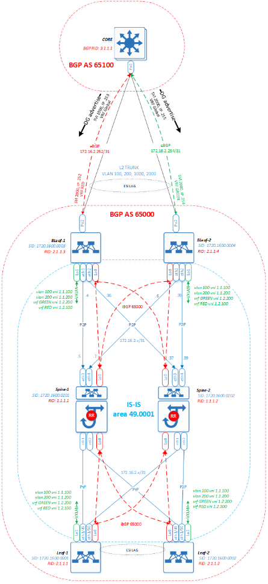
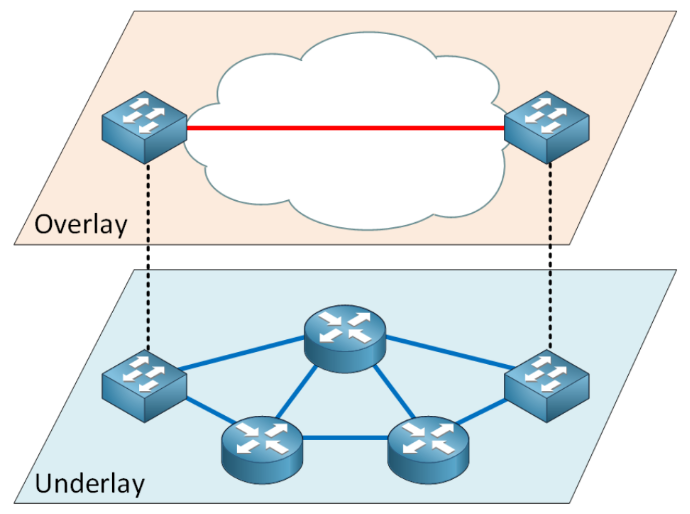
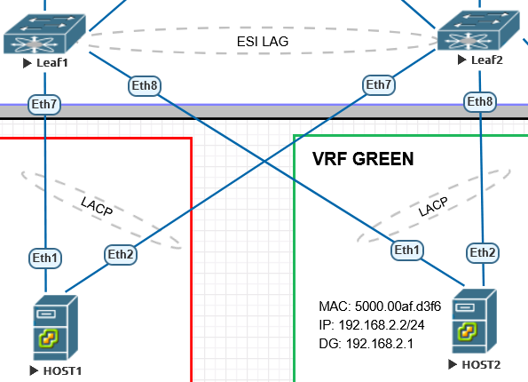
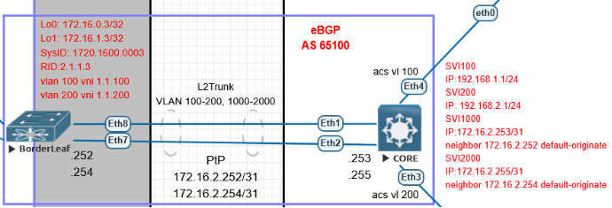

# Оглавление
[**План работы**](#_toc190888804)

[**Общее описание проекта**](#_toc190888805)

[**Описание используемых технологий и протоколов**](#_toc190888806)

[**Описание Underlay**](#_toc190888807)

[**Настройка глобальных параметров IS-IS**](#_toc190888808)

[**Настройка параметров интерфейсов IS-IS**](#_toc190888809)

[**Описание overlay**](#_toc190888810)

[**Настройка сервисных IP-VRF (тенантов). Anycast Gateway**](#_toc190888811)

[**Настройка VXLAN**](#_toc190888812)

[**Настройка iBGP EVPN**](#_toc190888813)

[**Настройка коммутаторов SPINE**](#_toc190888814)

[**Настройка коммутаторов LEAF**](#_toc190888815)

[**План IP адресации**](#_toc190888816)

[**Подключение хостов**](#_toc190888817)

[**Настройка ESI LAG**](#_toc190888818)

[**Сопряжение с действующей инфраструктурой**](#_toc190888819)

[**Настройка коммутатора Border Leaf**](#_toc190888820)

[**Настройка коммутатора Core**](#_toc190888821)

[**Настройка коммутатора Leaf**](#_toc190888822)

[**Вывод**](#_toc190888823)
# 

# **План работы**

|**1.**|Определение и описание общей архитектуры проекта. Выбор используемых технологий и протоколов, принципов взаимодействия компонентов и т.п.|
| :- | :- |
|**2.**|Разработка сетевых схем фабрики, сетевого стыка с действующей 3-tier сетью. Определение необходимых физических и логических сущностей (интерфейсы, VLAN, VRF, AS и.т.п.), их типа и количества, системы именования и идентификации|
|**3.**|Распределение пространства IP адресов для создаваемой сетевой фабрики, имен и идентификаторов всех создаваемых сущностей|
|**4.**|Моделирование разработанной системы на лабораторном стенде. Проверки корректности работы всех компонентов системы и полученного результата на соответствие цели проекта|
|**5.**|Документирование всех разработанных материалов по проекту – схемы, настройки, описания|
|**6.**|Выводы по результатам работы|

# **Общее описание проекта**

`	`Данная работа является выпускным проектом по курсу «Дизайн сетей ЦОД». Тема проекта **Бесшовная миграция серверной фермы из 3-tier сети в Clos-сеть на базе EVPN/VXLAN.**

`	`Целью проекта является разработка архитектуры для сети ДЦ на базе топологии CLOS с применением технологии VXLAN/EVPN и других сопутствующих технологий и протоколов, призванных оптимизировать работу сервисов, предоставляемых ДЦ. В проекте необходимо реализовать возможность для бесшовной миграции серверной фермы из действующей сетевой инфраструктуры в создаваемую модернизированную сетевую фабрику.

`	`Общая архитектура разрабатываемой сети представляет собой сетевую фабрику VXLAN/EVPN, имеющую сопряжение с действующей сетью, построенной по топологии Tier-3. В действующей сети располагается модуль серверной фермы, состоящий из хостов виртуализации с виртуальными машинами, предоставляющими различные конечные сервисы.

Ниже представлена логическая схема сети, разработанная для реализации цели данного проекта:

## **Описание используемых технологий и протоколов**

` 	`При построении сетевой фабрики для модернизированного ДЦ применяется двухслойная архитектура, состоящая из физической сети Underlay и набора сервисных виртуальных Overlay сетей, использующих Underlay в качестве транспорта для построения логических туннелей VXLAN.

## **Описание Underlay**

Сеть Underlay для данного проекта решено строить на основе физических интерфейсов с использованием протокола динамической маршрутизации IS-IS т.к. данный протокол обладает быстрой сходимостью, простой настройкой и хорошей масштабируемостью. 

Для адресации в Underlay используется пространство IP: **172.16.2.0/24**. Данное общее пространство разделяется на множество /31 сегментов для адресации физических интерфейсов, составляющих PtP-линки между коммутаторами Leaf и Spine. На данных PtP-линках строится соседство IS-IS для построения сети Underlay. 

### **Настройка глобальных параметров IS-IS**

router isis 100			- запускаем процесс IS-IS

net 49.0001.1720.1600.0001.00	- в качестве SysID в NET (Network Entity Title) используем преобразованный IP-адрес интерфейса Lo0, уникальный для каждого коммутатора. В данном примере использован адрес Lo0 коммутатора leaf-1 (172.16.0.1). Поле AFI для локальных сетей принимает значение 49, AreaID – 0001, SEL – 00.

is-hostname LEAF-1	- опциональное значение hostname, выводимое в некоторых случаях вместо SysID

is-type level-1	- явно указываем уровень IS (роутера) для минимизации служебного трафика

address-family ipv4 unicast		- указываем какой IP протокол будем маршрутизировать

log-adjacency-change			- логирование сообщений об изменениях соседства

### **Настройка параметров интерфейсов IS-IS**

interface Ethernet1			- режим конфигурирования интерфейса

isis network point-to-point		- тип сети указываем явно на PtP стыках коммутаторов

isis enable 100			- включаем интерфейс в настроенный процесс IS-IS

## **Описание overlay** 

Слой Overlay представляет собой комбинацию технологий VXLAN/EVPN, предназначенную для динамического построения виртуальных туннелей и передачи в них трафика сервисов поверх сети Underlay. В  данном проекте плоскость управления Overlay (EVPN) решено строить на основе протокола динамической маршрутизации iBGP (все узлы размещаются в одной автономной системе – ASN: **65000**) т.к. данный протокол при небольшом тюнинге таймеров и использовании вспомогательной технологии BFD обладает быстрой сходимостью, простой настройкой и полностью удовлетворяет целям проекта. Для организации VXLAN/EVPN используются логические интерфейсы: Loopback0 – для построения BGP-соседства EVPN и Loopback1 – для адресации VXLAN VTEP.

Для адресации интерфейсов в VXLAN/EVPN используются пространства адресов IP: **172.16.0.0/24 –** для Loopback 0 и **172.16.1.0/24 –** для Loopback 1. Данные пространства адресов разделяются на множество /32 узловых адресов для назначения непосредственно Loopback интерфейсам.

В данной работе для обмена трафиком внутри сетевой фабрики ДЦ и за ее пределами – в существующей 3-Tier сети, а так же с целью управления сетевыми сегментами созданы L2/L3 VPN (т.н. MAC-VRF и IP-VRF). Данные MAC-VRF и IP-VRF организованы в виде привязок VLAN и VRF, трафик которых должен передаваться, к соответствующим меткам VNI. Эти привязки (мапинг) осуществляются в контексте настройки виртуального туннельного интерфейса Vxlan1. От данного интерфейса с помощью EVPN (BGP) динамически строятся VXLAN туннели между VTEP, имеющими идентичные VNI.

`	`Для обмена маршрутной информацией между VTEP-ми произведены соответствующие настройки в секции протокола BGP. Информация о данных настройках приведена ниже

### **Настройка сервисных IP-VRF (тенантов). Anycast Gateway**

Сервисные сегменты организованы в виде VRF, включающих в себя необходимые интерфейсы L3 VLAN (aka SVI). Данные интерфейсы являются Anycast gateway, и выступают в роли шлюзов по-умолчанию для хостов в соответствующих сервисных сетях. Настройки этих интерфейсов на всех коммутаторах LEAF выполняются полностью идентично, включая IP-адреса. С помощью опции VIRTUAL включается технология Anycast Gateway, и дублирование этих адресов не вызывает ошибок на коммутаторах. Так же для работы Anycast Gateway необходимо на всех коммутаторах Leaf настроить виртуальный MAC-адрес, соответствующий данному Anycast Gateway IP-адресу. Данный виртуальный MAC так же на всех коммутаторах настраивается идентичным и выдается в ARP-ответах хостам на ARP-запросы к шлюзу по-умолчанию.

Сетевая адресация сервисных сегментов в данном проекте размещена в общем пространстве **192.168.0.0/16.** Данное пространство в дальнейшем сегментировано на /24 подсети, распределенные между тенантами (VRF) по мере необходимости.

`	`Настройки сервисных сетей выполняются только на коммутаторах Leaf !

vlan 100,200

!

vrf instance GREEN

!

vrf instance RED

!

interface Vlan100

`   `vrf RED

`   `ip address virtual 192.168.1.1/24

!

interface Vlan200

`   `vrf GREEN

`   `ip address virtual 192.168.2.1/24

!

ip virtual-router mac-address 00:00:80:00:00:00

!

ip routing vrf GREEN

ip routing vrf RED

!

### **Настройка VXLAN**

Настройки VXLAN выполняются на коммутаторах Leaf. Все настройки производятся в контексте конфигурирования виртуального интерфейса Vxlan (aka NVE):

vxlan vni notation dotted		- настройка формата представления номеров VNI с точками для удобства чтения

interface Vxlan1

`   `vxlan source-interface Loopback1		- интерфейс VTEP для построения VXLAN туннелей

`   `vxlan udp-port 4789				- порт UDP для приема VXLAN пакетов

`   `vxlan flood vtep learned data-plane		- список VTEP для установления VXLAN туннелей формируется изучением входящего VXLAN трафика

`   `vxlan vlan 100 vni 1.1.100			- мапинг VLAN к VNI

`   `vxlan vlan 200 vni 1.1.200

`   `vxlan vrf GREEN vni 1.2.200			- мапинг IP-VRF к VNI

`   `vxlan vrf RED vni 1.2.100

### **Настройка iBGP EVPN**

service routing protocols model multi-agent	- включение EVPN Control plane выполняется на всех коммутаторах

### **Настройка коммутаторов SPINE**

router bgp 65000	- запускаем процесс BGP с указанием ASN. При построении Underlay протокола iBGP, все коммутаторы POD размещаются в общую AS.

`   `router-id 1.1.1.1	- настройка RID. Для каждого коммутатора должен быть уникальным. В данной работе RID для коммутаторов SPINE принимает значения 1.1.1.0/8, для LEAF – 2.1.1.0/8

timers bgp 3 9	- настройка таймеров BGP для более быстрой сходимости

maximum-paths 10	- максимальное количество равнозначных маршрутов для ECMP

bgp listen range 172.16.2.0/24 peer-group POD-1\_EVPN remote-as 65000

- настройка динамической группы пиров, с которыми будет устанавливаться соседство. 

neighbor POD-1\_EVPN update-source Loopback0

- указываем интерфейс, от которого устанавливается соседство и отправляются bgp update

`   `neighbor POD-1\_EVPN allowas-in 3	- разрешаем прием входящих update, содержащие локальный ASN

neighbor POD-1\_EVPN route-reflector-client 

- включаем функцию ROUTE REFLECTOR в сторону соседа

`   `neighbor POD-1\_EVPN send-community extended

- включаем отправку параметра extended community в отсылаемых соседу анонсах

`   `neighbor POD-1\_EVPN maximum-routes 12000 warning-only

- указываем максимальное количество маршрутов, которые BGP примет для установки в RIB. Если значение не указано, по умолчанию устанавливается «неограниченное»

`   `!

`   `address-family evpn

`      `neighbor POD-1\_EVPN activate	- разрешаем обмен маршрутами AF с соседним маршрутизатором

!

### **Настройка коммутаторов LEAF**

router bgp 65000

`   `router-id 2.1.1.3

`   `timers bgp 3 9

`   `maximum-paths 10

`   `neighbor POD-1\_EVPN peer group

`   `neighbor POD-1\_EVPN remote-as 65000

`   `neighbor POD-1\_EVPN update-source Loopback0

`   `neighbor POD-1\_EVPN allowas-in 3

`   `neighbor POD-1\_EVPN send-community extended

`   `neighbor POD-1\_EVPN maximum-routes 12000 warning-only

`   `neighbor 172.16.0.201 peer group POD-1\_EVPN	- указываем соседей (все коммутаторы SPINE) статически

`   `neighbor 172.16.0.202 peer group POD-1\_EVPN

`   `!

`   `vlan 100						- настраиваем MAC-VRF для передачи трафика VLAN

`      `rd auto						- автоматическое назначение ROUTE DISTIGUISHER

`      `route-target both 65000:100	- принимать и передавать префиксы с данным RT в BGP EXTENDED COMUNITY

`      `redistribute learned				- распространять изученные MAC-IP префиксы

`   `!

`   `vlan 200

`      `rd auto

`      `route-target both 65000:200

`      `redistribute learned

`   `!

`   `address-family evpn

`      `neighbor POD-1\_EVPN activate		- активируем EVPN с соседями из пир-группы POD-1\_EVPN

`   `!

`   `address-family ipv4

`      `network 172.16.1.3/32	- анонсируем в BGP интерфейс для построения туннелей с VTEP (Loopback 1)

`   `!

`   `vrf GREEN

`      `rd 172.16.0.2:200

`      `route-target import evpn 65000:200

`      `route-target export evpn 65000:200

`      `redistribute connected

`   `!

`   `vrf RED

`      `rd 172.16.0.2:100

`      `route-target import evpn 65000:100

`      `route-target export evpn 65000:100

`      `redistribute connected

!

## **План IP адресации**

Общий план адресации Underlay/overlay на сетевых узлах фабрики

|**INT**|**Interface summary prefix**|**Range of addresses**|**Hosts**|
| :-: | :-: | :-: | :-: |
|Lo 0|172\.16.0.0/24|**Leaf:** 172.16.0.0 - 172.16.0.200 **Spine:** 172.16.0.201 - 172.16.0.255|256|
|Lo 1|172\.16.1.0/24|172\.16.1.0 - 172.16.1.200 172\.16.1.201 - 172.16.1.255|256|
|PtP|172\.16.2.0/24|172\.16.2.0 - 172.16.2.200 172\.16.2.201 - 172.16.2.255|256|
|Резерв|172\.16.3.0/24|172\.16.3.0 - 172.16.3.200 172\.16.3.201 - 172.16.3.255|256|

Адресация сервисных сетей

|**VRF**|**Subnet address**|**AnycastGW VIP**|**VLAN**|
| :-: | :-: | :-: | :-: |
|RED|192\.168.1.0/24|192\.168.1.1|100|
|GREEN|192\.168.2.0/24|192\.168.2.1|200|

Адресация интерфейсов лабораторного стенда

|** |**L0**|**L1**|**PtP** ||||||
| :-: | :-: | :-: | :-: | :- | :- | :- | :- | :- |
|Spine1|172\.16.0.201/32||
Eth1

172\.16.2.1/31
|
Eth2

172\.16.2.3/31
|
Eth3

172\.16.2.5/31
||||
|Spine2|172\.16.0.202/32|||||
Eth1

172\.16.2.33/31
|
Eth2

172\.16.2.35/31
|
Eth3

172\.16.2.37/31
|
|Leaf1|172\.16.0.1/32|172\.16.1.1/32|
Eth1

172\.16.2.2/31
|||
Eth2

172\.16.2.34/31
|||
|Leaf2|172\.16.0.2/32|172\.16.1.2/32||
Eth1

172\.16.2.4/31
|||
Eth2

172\.16.2.36/31
||
|Bleaf|172\.16.0.3/32|172\.16.1.3/32|||
Eth1

172\.16.2.6/31
|||
Eth2

172\.16.2.38/31
|

Адресация интерфейсов коммутатора CORE (ядро действующей 3-Tier сети)

|**INT**|**IP address**|**Назначение**|
| :-: | :-: | :-: |
|VLAN 100|192\.168.1.1|DGW для действующей серверной фермы|
|VLAN 200|192\.168.2.1|DGW для действующей серверной фермы|
|VLAN 1000|172\.16.2.253/31|PtP для BGP пиринга с Border leaf в VRF RED для VRF leaking и анонса DG, а так же префиксов, используемых в действующей 3-Tier сети в VXLAN фабрику|
|VLAN 2000|172\.16.2.255/31|PtP для BGP пиринга с Border leaf в VRF GREEN для VRF leaking и анонса DG, а так же префиксов, используемых в действующей 3-Tier сети в VXLAN фабрику|

## **Подключение хостов**

`	`В данном проекте принято решение для организации подключения конечных хостов к коммутаторам Leaf использовать технологию ESI LAG (EVPN Multihoming). 

Основные преимущества данной технологии:

- Возможность работать в режиме All-Active. Все линки могут быть активны и передавать unicast-трафик одновременно
- Резервирование на уровне канала. Даже если одна связь выйдет из строя, остальные связи всё равно будут работать. Они также принимают на себя тот трафик, который должен проходить через вышедшего из строя, поэтому пакет данных не будет потерян
- Отсутствие жёсткого ограничения на максимальное количество PE-устройств, обслуживающих multihomed-систему

Кроме того, в отличие от проприетарных решений на основе MLAG, ESI LAG не требует отдельного peer-link и синхронизации какие-то частей конфигурации, можно использовать мультивендорную среду.

`	`Ниже приведена схема подключения конечных хостов к паре коммутаторов Leaf с использованием ESI LAG

### **Настройка ESI LAG**

!

interface Port-Channel1

`   `switchport access vlan 100

`   `!

`   `evpn ethernet-segment

`      `identifier 0000:0050:0000:0001:0000

`      `route-target import 00:50:00:00:00:01

`   `lacp system-id 1111.1111.1111

!

interface Port-Channel2

`   `switchport access vlan 200

`   `!

`   `evpn ethernet-segment

`      `identifier 0000:0050:0000:0001:0001

`      `route-target import 00:50:00:00:00:01

`   `lacp system-id 1111.1111.1111

!

interface Ethernet7

`   `description Po1\_mmbr

`   `channel-group 1 mode active

`   `lacp timer fast

!

interface Ethernet8

`   `description Po2\_mmbr

`   `channel-group 2 mode active

`   `lacp timer fast

!

На остальных коммутаторах Leaf, входящих в группу EVPN Multihoming производятся идентичные настройки. На коммутаторах Spine настройка не производится.

## **Сопряжение с действующей инфраструктурой**

Для интеграции создаваемой сетевой фабрики с действующей сетевой инфраструктурой принято решение организовать L2/L3 взаимодействие между коммутатором Border Leaf фабрики VXLAN/EVPN с коммутатором ядра действующей 3-Tier сети. L2 связность необходима для бесшовной миграции ВМ между хостами, подключенными к действующей сети и хостами, развернутыми в VXLAN/EVPN  фабрике. L3 связность необходима для анонсирования в сетевую фабрику ДЦ префиксов, используемых в работе действующей инфраструктуры. Так же через L3 связь ядро действующей сети рекламирует свои интерфейсы в качестве шлюзов по-умолчанию в соответствующие сегменты сетевой фабрики ДЦ. Таким образом осуществляется интеграция ДЦ с внешним миром, а так же – взаимодействие и контроль трафика между различными тенантами фабрики (VRF leaking).

Действующая серверная ферма размещается в VLAN100 и VLAN200 в 3-Tier сети. Хосты в VLAN100 используют IP-адреса в сегменте **192.168.1.0/24,** шлюз по-умолчанию – 192.168.1.1**.** Хосты в VLAN200 используют IP-адреса в сегменте **192.168.2.0/24,** шлюз по-умолчанию – 192.168.2.1**.**

В проектируемой сети ДЦ хосты размещаются так же в VLAN 100  и 200 (но в разных VRF), и используют идентичную адресацию сетей и шлюзов, как и в первоначальном размещении (3-Tier). Таким образом для конечных хостов обеспечивается полностью идентичное окружение при миграции, за исключением MAC-адреса шлюза по-умолчанию. При миграции в сеть нового ДЦ, шлюзом становится соответствующий VLAN-интерфейс Leaf-коммутатора. Единственное ручное действие, которое после миграции необходимо произвести на ВМ – очистить ARP-кэш.

Ниже приведен фрагмент схемы, на котором отображен стык проектируемой сетевой фабрики с действующей 3-Tier сетью

### **Настройка коммутатора Border Leaf**

!

vlan 100,200,1000,2000

!

vrf instance GREEN

!

vrf instance RED

!

interface Port-Channel2

`   `switchport trunk allowed vlan 100,200,1000,2000

`   `switchport mode trunk

!

interface Ethernet7

`   `description Po2\_mmbr

`   `channel-group 2 mode active

!

interface Ethernet8

`   `description Po2\_mmbr

`   `channel-group 2 mode active

!

interface Vlan100

`   `vrf RED

`   `ip address 192.168.1.254/24

!

interface Vlan200

`   `vrf GREEN

`   `ip address 192.168.2.254/24

!

interface Vlan1000

`   `vrf RED

`   `ip address 172.16.2.252/31

!

interface Vlan2000

`   `vrf GREEN

`   `ip address 172.16.2.254/31

!

ip routing vrf GREEN

ip routing vrf RED

!

router bgp 65000

vrf GREEN

`      `rd 172.16.0.3:200

`      `default-route export evpn

`      `route-target import evpn 65000:200

`      `route-target export evpn 65000:200

`      `neighbor 172.16.2.255 remote-as 65100

`      `neighbor 172.16.2.255 update-source Vlan2000

`   `!

`   `vrf RED

`      `rd 172.16.0.3:100

`      `default-route export evpn

`      `route-target import evpn 65000:100

`      `route-target export evpn 65000:100

`      `neighbor 172.16.2.253 remote-as 65100

`      `neighbor 172.16.2.253 update-source Vlan1000

!
### **Настройка коммутатора Core**

vlan 100,200,1000,2000

!

interface Port-Channel1

`   `switchport trunk allowed vlan 100,200,1000,2000

`   `switchport mode trunk

!

interface Ethernet1

`   `description Po1\_mmbr

`   `channel-group 1 mode active

!

interface Ethernet2

`   `description Po1\_mmbr

`   `channel-group 1 mode active

!

interface Vlan100

`   `ip address 192.168.1.1/24

!

interface Vlan200

`   `ip address 192.168.2.1/24

!

interface Vlan1000

`   `ip address 172.16.2.253/31

!

interface Vlan2000

`   `ip address 172.16.2.255/31

!

ip routing

!

ip route 0.0.0.0/0 8.8.8.8

!

router bgp 65100

`   `router-id 3.1.1.1

`   `neighbor 172.16.2.252 remote-as 65000

`   `neighbor 172.16.2.252 update-source Vlan1000

`   `neighbor 172.16.2.252 default-originate

`   `neighbor 172.16.2.254 remote-as 65000

`   `neighbor 172.16.2.254 update-source Vlan2000

`   `neighbor 172.16.2.254 default-originate

!

### **Настройка коммутатора Leaf**

!

interface Vlan100

`   `vrf RED

`   `ip address virtual 192.168.1.1/24

!

interface Vlan200

`   `vrf GREEN

`   `ip address virtual 192.168.2.1/24

!

ip virtual-router mac-address 00:00:80:00:00:00

!

## **Вывод**

В результате работы над данным проектом мы получили рабочий макет сетевой фабрики VXLAN/EVPN, построенный по топологии CLOS и имеющий интеграцию с сетью 3-Tier, в которой развернута действующая серверная ферма предприятия. Обеспечена полная сетевая связность между узлами в сетях CLOS и 3-Tier, позволяющая осуществлять любые миграции виртуальных машин между действующей и новой инфраструктурой без прерывания сервисов. Реализовано отказоустойчивое all-active подключение конечных хостов.

Таким образом цель проекта достигнута!

