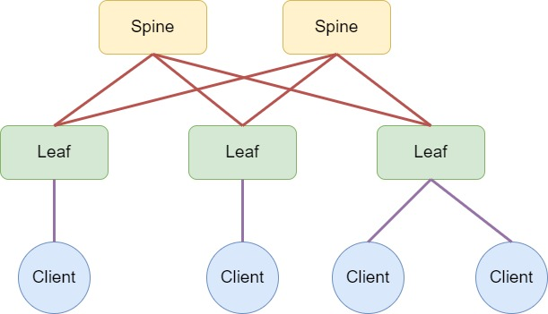

# Оглавление
[**План работы**](#_toc186104402)

[**Топология лабораторного стенда**](#_toc186104403)

[**План IP-адресации слоя Underlay**](#_toc186104404)

[**Описание формата адресов**](#_toc186104405)

[**Underlay**](#_toc186104406)

[**DC1 (пример)**](#_toc186104407)

[**DC1, POD1 (пример)**](#_toc186104408)

[**Services**](#_toc186104409)

[**Адресация интерфейсов лабораторного стенда**](#_toc186104410)
#  

# <a name="_toc186104402"></a>**План работы**

1. Собрать топологию CLOS, как на схеме 




1. В эмуляторе EVE-NG добавить на топологию необходимое количество устройств (Nodes):
   1. Arista vEOS switch – 5 шт.
   1. Virtual PC (VPCS) – 4 шт.
1. Присвоить устройствам имена в зависимости от роли (Spine, Leaf, Host)
1. Создать между устройствами необходимые связи
1. Запустить все устройства
1. Распределить адресное пространство для Underlay сети
   1. Определиться с адресуемыми объектами их типом и количеством – ЦОД, POD, Interfaces(PtP, Loopback)
   1. Выбрать общие диапазоны адресов для распределения
   1. Разделить выбранные общие диапазоны на более мелкие в соответствии с результатами предыдущих шагов. При разделении диапазонов учитывать необходимость их дальнейшей суммаризации для протоколов маршрутизации
1. Присвоить IP-адреса соответствующим интерфейсам лабораторного стенда согласно разработанного плана
1. Задокументировать результаты работы

# <a name="_toc186104403"></a>**Топология лабораторного стенда**


# <a name="_toc186104404"></a>**План IP-адресации слоя Underlay**

8xDC (Net: /15)

64xPOD/DC (4xSpine\*30xLeaf, Net: /22)

4xUnderlay net/POD (P2P, Lo0, Lo1, Reserve; Net /24)

**Общее пространство для распределения**

172\.16.0.0/12 – Underlay

10\.0.0.0/8 - Services

## <a name="_toc186104405"></a>**Описание формата адресов**

### <a name="_toc186104406"></a>**Underlay**

172\.DNR.PnI.X/22

DNR – Datacenter net range

PnI – POD number + Interface (Loopback 0/1, PtP, Reserve)

X – Interface address, (Для Loopback: 1..200 – Leaf, 201..254 – Spine; Для PtP: Четные – Leaf, Нечетные – Spine)

**DNR – Datacenter Underlay net range**

DC1 DNR – 16-17

DC2 DNR – 18-19

..

DC8 DNR – 30-31

|**DCN**|**DC summary prefix**|**Range of addresses**|**Hosts**|
| :-: | :-: | :-: | :-: |
|DC 1|172\.16.0.0/15|172\.16.0.0 - 172.17.255.255|131072|
|DC 2|172\.18.0.0/15|172\.18.0.0 - 172.19.255.255|131072|
|DC 3|172\.20.0.0/15|172\.20.0.0 - 172.21.255.255|131072|
|DC 4|172\.22.0.0/15|172\.22.0.0 - 172.23.255.255|131072|
|DC 5|172\.24.0.0/15|172\.24.0.0 - 172.25.255.255|131072|
|DC 6|172\.26.0.0/15|172\.26.0.0 - 172.27.255.255|131072|
|DC 7|172\.28.0.0/15|172\.28.0.0 - 172.29.255.255|131072|
|DC 8|172\.30.0.0/15|172\.30.0.0 - 172.31.255.255|131072|


### <a name="_toc186104407"></a>**DC1 (пример)**

**PnI – POD number + Interface (Loopback 0/1, PtP, Reserve)**

POD 1

172\.16.[0 .. 3].X

0 – Loopback 0, 1 – Loopback 1, 2 – PtP, 3 – Reserve

POD 2

4 .. 7

4 – Loopback 0, 5 – Loopback 1, 6 – PtP, 7 - Reserve

POD 3

8 .. 11

8 – Loopback 0, 9 – Loopback 1, 10 – PtP, 11 – Reserve

..

POD 32

252 .. 255

252 – Loopback 0, 253 – Loopback 1, 254 – PtP, 255 – Reserve

POD 33

172\.17.[0 .. 3].X

0 – Loopback 0, 1 – Loopback 1, 2 – PtP, 3 – Reserve

..

POD 64

252 .. 255

252 – Loopback 0, 253 – Loopback 1, 254 – PtP, 255 – Reserve

|**POD №**|**POD summary prefix**|**Range of addresses**|**Hosts**|
| :-: | :-: | :-: | :-: |
|1|172\.16.0.0/22|172\.16.0.0 - 172.16.3.255|1024|
|2|172\.16.4.0/22|172\.16.4.0 - 172.16.7.255|1024|
|…||||
|32|172\.16.252.0/22|172\.16.252.0 - 172.16.255.255|1024|
|33|172\.17.0.0/22|172\.17.0.0 - 172.17.3.255|1024|
|…||||
|64|172\.17.252.0/22|172\.17.252.0 - 172.17.255.255|1022|

### <a name="_toc186104408"></a>**DC1, POD1 (пример)**

|**INT**|**Interface summary prefix**|**Range of addresses**|**Hosts**|
| :-: | :-: | :-: | :-: |
|Lo 0|172\.16.0.0/24|**Leaf:** 172.16.0.0 - 172.16.0.199<br>**Spine:** 172.16.0.200 - 172.16.0.255|256|
|Lo 1|172\.16.1.0/24|**Leaf:** 172\.16.1.0 - 172.16.1.199<br>**Spine:** 172\.16.1.200 - 172.16.1.255|256|
|PtP|172\.16.2.0/24|172\.16.2.0 - 172.16.2.255|256|
|Res|172\.16.3.0/24|172\.16.3.0 - 172.16.3.255|256|

### <a name="_toc186104409"></a>**Services**

|**DCN**|**Subnet address**|**Range of addresses**|**Hosts**|
| :-: | :-: | :-: | :-: |
|DC 1|10\.0.0.0/11|10\.0.0.0 - 10.31.255.255|2097150|
|DC 2|10\.32.0.0/11|10\.32.0.0 - 10.63.255.255|2097150|
|DC 3|10\.64.0.0/11|10\.64.0.0 - 10.95.255.255|2097150|
|DC 4|10\.96.0.0/11|10\.96.0.0 - 10.127.255.255|2097150|
|DC 5|10\.128.0.0/11|10\.128.0.0 - 10.159.255.255|2097150|
|DC 6|10\.160.0.0/11|10\.160.0.0 - 10.191.255.255|2097150|
|DC 7|10\.192.0.0/11|10\.192.0.0 - 10.223.255.255|2097150|
|DC 8|10\.224.0.0/11|10\.224.0.0 - 10.255.255.255|2097150|

# <a name="_toc186104410"></a>**Адресация интерфейсов лабораторного стенда**

|** |**L0**|**L1**|**PtP** ||||||
| :-: | :-: | :-: | :-: | :- | :- | :- | :- | :- |
|Spine1|172\.16.0.201/32||<p>Eth1</p><p>172\.16.2.1/31</p>|<p>Eth2</p><p>172\.16.2.3/31</p>|<p>Eth3</p><p>172\.16.2.5/31</p>||||
|Spine2|172\.16.0.202/32|||||<p>Eth1</p><p>172\.16.2.33/31</p>|<p>Eth2</p><p>172\.16.2.35/31</p>|<p>Eth3</p><p>172\.16.2.37/31</p>|
|Leaf1|172\.16.0.1/32|172\.16.1.1/32|<p>Eth1</p><p>172\.16.2.2/31</p>|||<p>Eth2</p><p>172\.16.2.34/31</p>|||
|Leaf2|172\.16.0.2/32|172\.16.1.2/32||<p>Eth1</p><p>172\.16.2.4/31</p>|||<p>Eth2</p><p>172\.16.2.36/31</p>||
|Leaf3|172\.16.0.3/32|172\.16.1.3/32|||<p>Eth1</p><p>172\.16.2.6/31</p>|||<p>Eth2</p><p>172\.16.2.38/31</p>|

```
spine-1#sh ip int br


Interface        IP Address          Status     Protocol       MTU       Owner  

--------------- ------------------- ---------- ------------- ---------- -------

Ethernet1       172.16.2.1/31       up         up               9214           

Ethernet2       172.16.2.3/31       up         up               9214           

Ethernet3       172.16.2.5/31       up         up               9214           

Loopback0       172.16.0.201/32     up         up              65535           

Management1     unassigned          up         up               1500
```

```
spine-2(config)#sh ip int br

Interface        IP Address          Status     Protocol       MTU       Owner  

--------------- ------------------- ---------- ------------- ---------- -------

Ethernet1       172.16.2.33/31      up         up               9214           

Ethernet2       172.16.2.35/31      up         up               9214           

Ethernet3       172.16.2.37/31      up         up               9214           

Loopback0       172.16.0.202/32     up         up              65535           

Management1     unassigned          up         up               1500
```

```
leaf-1#sh ip int br

Interface       IP Address         Status      Protocol          MTU    Owner  

--------------- ------------------ ----------- ------------- ---------- -------

Ethernet1       172.16.2.2/31      up          up               9214           

Ethernet2       172.16.2.34/31     up          up               9214           

Loopback0       172.16.0.1/32      up          up              65535           

Loopback1       172.16.1.1/32      up          up              65535           

Management1     unassigned         up          up               1500     
```

```
leaf-2#sh ip int br

Interface       IP Address         Status      Protocol          MTU    Owner  

--------------- ------------------ ----------- ------------- ---------- -------

Ethernet1       172.16.2.4/31      up          up               9214           

Ethernet2       172.16.2.36/31     up          up               9214           

Loopback0       172.16.0.2/32      up          up              65535           

Loopback1       172.16.1.2/32      up          up              65535           

Management1     unassigned         up          up               1500  
```

```
leaf-3#sh ip int br

Interface       IP Address         Status      Protocol          MTU    Owner  

--------------- ------------------ ----------- ------------- ---------- -------

Ethernet1       172.16.2.6/31      up          up               9214           

Ethernet2       172.16.2.38/31     up          up               9214           

Loopback0       172.16.0.3/32      up          up              65535           

Loopback1       172.16.1.3/32      up          up              65535           

Management1     unassigned         up          up               1500
