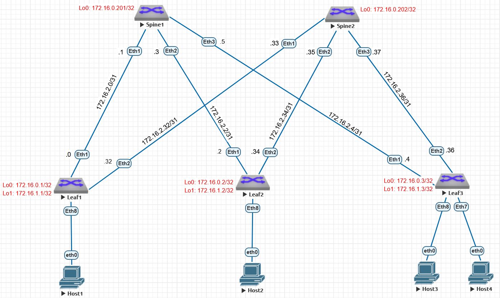

# Оглавление
[**План работы**	1](#_toc187079726)

[**Топология лабораторного стенда**	1](#_toc187079727)

[**Настройка Underlay. OSPF**	2](#_toc187079728)

[**Настройка глобальных параметров OSPF**	2](#_toc187079729)

[**Настройка параметров интерфейсов OSPF**	2](#_toc187079730)

[**Проверка корректности работы OSPF**	3](#_toc187079731)

[**Настройка BFD**	6](#_toc187079732)

[**Проверка BFD**	6](#_toc187079733)
# 

# <a name="_toc187079726"></a>**План работы**

1. Настроить протокол OSPF - глобальные параметры
1. Настроить протокол OSPF - параметры интерфейсов
1. Настроить BFD на PtP интерфейсах, проверить корректность
1. Проверить наличие префиксов, полученных по OSPF, проверить доступность узлов 
1. Задокументировать результаты работы

# <a name="_toc187079727"></a>**Топология лабораторного стенда**


# <a name="_toc187079728"></a>**Настройка Underlay. OSPF**

## <a name="_toc187079729"></a>**Настройка глобальных параметров OSPF**

router ospf 100			- запускаем процесс OSPF

router-id 172.16.0.201	- в качестве RID используем IP-адрес интерфейса Lo0, уникальный для каждого коммутатора

passive-interface default		- по умолчанию все интерфейсы выключены из OSPF

no passive-interface Ethernet1	- включаем в процесс маршрутизации нужные интерфейсы

no passive-interface Ethernet2

no passive-interface Ethernet3

log-adjacency-changes detail		- детальное логирование сообщений об изменениях соседства

## <a name="_toc187079730"></a>**Настройка параметров интерфейсов OSPF**

interface Ethernet1			- режим конфигурирования интерфейса

ip ospf network point-to-point	- тип сети указываем явно на PtP стыках коммутаторов

ip ospf area 0.0.0.0			- включаем интерфейс в нужную зону OSPF

События в консоли коммутатора Spine-1:

spine-1#Jan  6 11:44:32 spine-1 Rib: Instance 100: %OSPF-4-OSPF\_STATE\_CHANGE: NGB 172.16.0.2, intf 172.16.2.2 change from DOWN to DOWN

Jan  6 11:44:32 spine-1 Rib: Instance 100: %OSPF-4-OSPF\_STATE\_CHANGE: NGB 172.16.0.2, intf 172.16.2.2 change from DOWN to INIT

Jan  6 11:44:32 spine-1 Rib: Instance 100: %OSPF-4-OSPF\_STATE\_CHANGE: NGB 172.16.0.2, intf 172.16.2.2 change from INIT to 2 WAYS

Jan  6 11:44:32 spine-1 Rib: Instance 100: %OSPF-4-OSPF\_STATE\_CHANGE: NGB 172.16.0.2, intf 172.16.2.2 change from 2 WAYS to EXCH START

Jan  6 11:44:32 spine-1 Rib: Instance 100: %OSPF-4-OSPF\_STATE\_CHANGE: NGB 172.16.0.2, intf 172.16.2.2 change from EXCH START to EXCHANGE

Jan  6 11:44:32 spine-1 Rib: Instance 100: %OSPF-4-OSPF\_STATE\_CHANGE: NGB 172.16.0.2, intf 172.16.2.2 change from EXCHANGE to FULL

Jan  6 11:44:32 spine-1 Rib: Instance 100: %OSPF-4-OSPF\_ADJACENCY\_ESTABLISHED: NGB 172.16.0.2, interface 172.16.2.3 adjacency established

Jan  6 11:50:35 spine-1 Rib: Instance 100: %OSPF-4-OSPF\_STATE\_CHANGE: NGB 172.16.0.3, intf 172.16.2.4 change from DOWN to DOWN

Jan  6 11:50:35 spine-1 Rib: Instance 100: %OSPF-4-OSPF\_STATE\_CHANGE: NGB 172.16.0.3, intf 172.16.2.4 change from DOWN to INIT

Jan  6 11:50:35 spine-1 Rib: Instance 100: %OSPF-4-OSPF\_STATE\_CHANGE: NGB 172.16.0.3, intf 172.16.2.4 change from INIT to 2 WAYS

Jan  6 11:50:35 spine-1 Rib: Instance 100: %OSPF-4-OSPF\_STATE\_CHANGE: NGB 172.16.0.3, intf 172.16.2.4 change from 2 WAYS to EXCH START

Jan  6 11:50:35 spine-1 Rib: Instance 100: %OSPF-4-OSPF\_STATE\_CHANGE: NGB 172.16.0.3, intf 172.16.2.4 change from EXCH START to EXCHANGE

Jan  6 11:50:35 spine-1 Rib: Instance 100: %OSPF-4-OSPF\_STATE\_CHANGE: NGB 172.16.0.3, intf 172.16.2.4 change from EXCHANGE to FULL

Jan  6 11:50:35 spine-1 Rib: Instance 100: %OSPF-4-OSPF\_ADJACENCY\_ESTABLISHED: NGB 172.16.0.3, interface 172.16.2.5 adjacency established

События в консоли коммутатора Leaf-3:

leaf-3#Jan  6 11:50:30 leaf-3 Rib: Instance 100: %OSPF-4-OSPF\_STATE\_CHANGE: NGB 172.16.0.201, intf 172.16.2.5 change from DOWN to DOWN

Jan  6 11:50:30 leaf-3 Rib: Instance 100: %OSPF-4-OSPF\_STATE\_CHANGE: NGB 172.16.0.201, intf 172.16.2.5 change from DOWN to INIT

Jan  6 11:50:36 leaf-3 Rib: Instance 100: %OSPF-4-OSPF\_STATE\_CHANGE: NGB 172.16.0.201, intf 172.16.2.5 change from INIT to 2 WAYS

Jan  6 11:50:36 leaf-3 Rib: Instance 100: %OSPF-4-OSPF\_STATE\_CHANGE: NGB 172.16.0.201, intf 172.16.2.5 change from 2 WAYS to EXCH START

Jan  6 11:50:36 leaf-3 Rib: Instance 100: %OSPF-4-OSPF\_STATE\_CHANGE: NGB 172.16.0.201, intf 172.16.2.5 change from EXCH START to EXCHANGE

Jan  6 11:50:36 leaf-3 Rib: Instance 100: %OSPF-4-OSPF\_STATE\_CHANGE: NGB 172.16.0.201, intf 172.16.2.5 change from EXCHANGE to LOADING

Jan  6 11:50:36 leaf-3 Rib: Instance 100: %OSPF-4-OSPF\_STATE\_CHANGE: NGB 172.16.0.201, intf 172.16.2.5 change from LOADING to FULL

Jan  6 11:50:36 leaf-3 Rib: Instance 100: %OSPF-4-OSPF\_ADJACENCY\_ESTABLISHED: NGB 172.16.0.201, interface 172.16.2.4 adjacency established

Jan  6 11:50:36 leaf-3 Rib: Instance 100: %OSPF-4-OSPF\_STATE\_CHANGE: NGB 172.16.0.202, intf 172.16.2.37 change from DOWN to DOWN

Jan  6 11:50:36 leaf-3 Rib: Instance 100: %OSPF-4-OSPF\_STATE\_CHANGE: NGB 172.16.0.202, intf 172.16.2.37 change from DOWN to INIT

Jan  6 11:50:36 leaf-3 Rib: Instance 100: %OSPF-4-OSPF\_STATE\_CHANGE: NGB 172.16.0.202, intf 172.16.2.37 change from INIT to 2 WAYS

Jan  6 11:50:36 leaf-3 Rib: Instance 100: %OSPF-4-OSPF\_STATE\_CHANGE: NGB 172.16.0.202, intf 172.16.2.37 change from 2 WAYS to EXCH START

Jan  6 11:50:41 leaf-3 Rib: Instance 100: %OSPF-4-OSPF\_STATE\_CHANGE: NGB 172.16.0.202, intf 172.16.2.37 change from EXCH START to EXCHANGE

Jan  6 11:50:41 leaf-3 Rib: Instance 100: %OSPF-4-OSPF\_STATE\_CHANGE: NGB 172.16.0.202, intf 172.16.2.37 change from EXCHANGE to FULL

Jan  6 11:50:41 leaf-3 Rib: Instance 100: %OSPF-4-OSPF\_ADJACENCY\_ESTABLISHED: NGB 172.16.0.202, interface 172.16.2.36 adjacency established


# <a name="_toc187079731"></a>**Проверка корректности работы OSPF**
```
spine-1#sh ip ospf int br

Interface          Instance VRF        Area            IP Address         Cost  State      Nbrs

Lo0                100      default    0.0.0.0         172.16.0.201/32    10    DR         0

Et1                100      default    0.0.0.0         172.16.2.1/31      10    P2P        1

Et2                100      default    0.0.0.0         172.16.2.3/31      10    P2P        1

Et3                100      default    0.0.0.0         172.16.2.5/31      10    P2P        1

spine-1#
```
```
spine-2#sh ip ospf int br

Interface          Instance VRF        Area            IP Address         Cost  State      Nbrs

Lo0                100      default    0.0.0.0         172.16.0.202/32    10    DR         0

Et1                100      default    0.0.0.0         172.16.2.33/31     10    P2P        1

Et2                100      default    0.0.0.0         172.16.2.35/31     10    P2P        1

Et3                100      default    0.0.0.0         172.16.2.37/31     10    P2P        1

spine-2#
```

```
leaf-1#sh ip ospf int br

Interface          Instance VRF        Area            IP Address         Cost  State      Nbrs

Lo0                100      default    0.0.0.0         172.16.0.1/32      10    DR         0

Et1                100      default    0.0.0.0         172.16.2.0/31      10    P2P        1

Et2                100      default    0.0.0.0         172.16.2.32/31     10    P2P        1
```
```
leaf-2#sh ip ospf int br

Interface          Instance VRF        Area            IP Address         Cost  State      Nbrs

Lo0                100      default    0.0.0.0         172.16.0.2/32      10    DR         0

Et1                100      default    0.0.0.0         172.16.2.2/31      10    P2P        1

Et2                100      default    0.0.0.0         172.16.2.34/31     10    P2P        1

leaf-2#
```
```
leaf-3#sh ip ospf int br

Interface          Instance VRF        Area            IP Address         Cost  State      Nbrs

Et1                100      default    0.0.0.0         172.16.2.4/31      10    P2P        1

Et2                100      default    0.0.0.0         172.16.2.36/31     10    P2P        1

Lo0                100      default    0.0.0.0         172.16.0.3/32      10    DR         0

leaf-3#
```
```
spine-1#sh ip route 

VRF: default

Codes: C - connected, S - static, K - kernel, 

         O - OSPF, IA - OSPF inter area, E1 - OSPF external type 1,

         E2 - OSPF external type 2, N1 - OSPF NSSA external type 1,

         N2 - OSPF NSSA external type2, B - Other BGP Routes,

         B I - iBGP, B E - eBGP, R - RIP, I L1 - IS-IS level 1,

         I L2 - IS-IS level 2, O3 - OSPFv3, A B - BGP Aggregate,

         A O - OSPF Summary, NG - Nexthop Group Static Route,

         V - VXLAN Control Service, M - Martian,

         DH - DHCP client installed default route,

         DP - Dynamic Policy Route, L - VRF Leaked,

         G  - gRIBI, RC - Route Cache Route

Gateway of last resort is not set

   O        172.16.0.1/32 [110/20] via 172.16.2.0, Ethernet1	- в наличии префиксы интерфейсов Loopback

   O        172.16.0.2/32 [110/20] via 172.16.2.2, Ethernet2

   O        172.16.0.3/32 [110/20] via 172.16.2.4, Ethernet3

   C        172.16.0.201/32 is directly connected, Loopback0

   O        172.16.0.202/32 [110/30] via 172.16.2.0, Ethernet1

                                     via 172.16.2.2, Ethernet2

                                     via 172.16.2.4, Ethernet3

   C        172.16.2.0/31 is directly connected, Ethernet1

   C        172.16.2.2/31 is directly connected, Ethernet2

   C        172.16.2.4/31 is directly connected, Ethernet3

   O        172.16.2.32/31 [110/20] via 172.16.2.0, Ethernet1

   O        172.16.2.34/31 [110/20] via 172.16.2.2, Ethernet2

   O        172.16.2.36/31 [110/20] via 172.16.2.4, Ethernet3
```
```   
   Трассировка маршрута к интерфейсу Loopback0 на Spine-2

spine-1#trace 172.16.0.202

traceroute to 172.16.0.202 (172.16.0.202), 30 hops max, 60 byte packets

   1  172.16.2.0 (172.16.2.0)  51.792 ms  60.039 ms  62.016 ms

   2  172.16.0.202 (172.16.0.202)  78.198 ms  86.267 ms  103.153 ms

spine-1#
```
```
Трассировка маршрута к интерфейсу Loopback0 на Leaf-1

leaf-3#trace 172.16.0.1

traceroute to 172.16.0.1 (172.16.0.1), 30 hops max, 60 byte packets

   1  172.16.2.5 (172.16.2.5)  41.263 ms  41.955 ms  52.323 ms

   2  172.16.0.1 (172.16.0.1)  68.049 ms  72.605 ms  84.229 ms

leaf-3#
```
```
Трассировка маршрута к интерфейсу Loopback0 на Leaf-3

leaf-2#trace 172.16.0.3

traceroute to 172.16.0.3 (172.16.0.3), 30 hops max, 60 byte packets

   1  172.16.2.3 (172.16.2.3)  37.478 ms  41.904 ms  51.996 ms

   2  172.16.0.3 (172.16.0.3)  73.398 ms  82.985 ms  88.988 ms

leaf-2#
```

# <a name="_toc187079732"></a>**Настройка BFD**

Для настройки BFD на PtP интерфейсах выполнить команды:

interface Ethernet1 – Ethernet3		- режим настройки интерфейсов

bfd interval 100 min-rx 100 multiplier 3		- настройка интервалов проверок связности между пирами и число неуспешных проверок для определения неработоспособности линка

ip ospf neighbor bfd		- определение доступности OSPF-соседа в зависимости от состояния BFD

## <a name="_toc187079733"></a>**Проверка BFD**

Для проверки состояния BFD команда **sh bfd peer:**

```
spine-1#sh bfd peer

VRF name: default

-----------------

DstAddr        MyDisc    YourDisc  Interface/Transport    Type          LastUp 

---------- ----------- ----------- -------------------- ------- ---------------

172\.16.2.0  803456421  2777827480        Ethernet1(14)  normal  01/06/25 14:40 

172\.16.2.2 3368603167  3942181760        Ethernet2(15)  normal  01/06/25 14:46 

172\.16.2.4 2451369836  4248678098        Ethernet3(16)  normal  01/06/25 14:55 

                        LastDown            LastDiag    State

-------------------- ------------------- -----

                 NA       No Diagnostic       Up

                 NA       No Diagnostic       Up

01/06/25 14:52       No Diagnostic       Up

spine-1#
```
```
spine-2#sh bfd peer

VRF name: default

-----------------

DstAddr         MyDisc   YourDisc  Interface/Transport    Type          LastUp 

----------- ---------- ----------- -------------------- ------- ---------------

172\.16.2.32 3393716094 3131161576        Ethernet1(14)  normal  01/06/25 14:40 

172\.16.2.34 1280183576 1443503653        Ethernet2(15)  normal  01/06/25 14:46 

172\.16.2.36 3873754296  767736885        Ethernet3(16)  normal  01/06/25 14:55 

                        LastDown            LastDiag    State

-------------------- ------------------- -----

                 NA       No Diagnostic       Up

                 NA       No Diagnostic       Up

01/06/25 14:52       No Diagnostic       Up

spine-2#
```
```

leaf-1#sh bfd peer

VRF name: default

-----------------

DstAddr         MyDisc   YourDisc  Interface/Transport    Type          LastUp 

----------- ---------- ----------- -------------------- ------- ---------------

172\.16.2.1  2777827480  803456421        Ethernet1(15)  normal  01/06/25 14:40 

172\.16.2.33 3131161576 3393716094        Ethernet2(16)  normal  01/06/25 14:40 

LastDown            LastDiag    State

-------------- ------------------- -----

                        NA       No Diagnostic       Up

                        NA       No Diagnostic       Up

leaf-1#
```
```

leaf-2#sh bfd peer

VRF name: default

-----------------

DstAddr         MyDisc   YourDisc  Interface/Transport    Type          LastUp 

----------- ---------- ----------- -------------------- ------- ---------------

172\.16.2.3  3942181760 3368603167        Ethernet1(15)  normal  01/06/25 14:46 

172\.16.2.35 1443503653 1280183576        Ethernet2(16)  normal  01/06/25 14:46 

LastDown            LastDiag    State

-------------- ------------------- -----

                        NA       No Diagnostic       Up

                        NA       No Diagnostic       Up

leaf-2#
```
```

leaf-3#sh bfd peer

VRF name: default

-----------------

DstAddr         MyDisc   YourDisc  Interface/Transport    Type          LastUp 

----------- ---------- ----------- -------------------- ------- ---------------

172\.16.2.5  4248678098 2451369836        Ethernet1(15)  normal  01/06/25 14:55 

172\.16.2.37  767736885 3873754296        Ethernet2(16)  normal  01/06/25 14:55 

LastDown            LastDiag    State

-------------- ------------------- -----

                        NA       No Diagnostic       Up

                        NA       No Diagnostic       Up

leaf-3#

