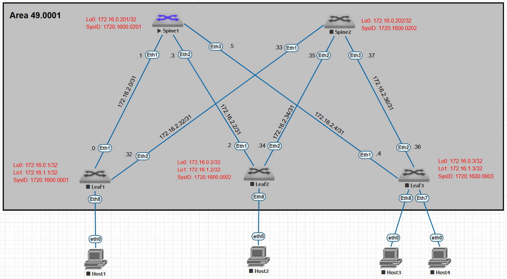

# Оглавление
[**План работы**](#_toc187323578)

[**Топология лабораторного стенда**](#_toc187323579)

[**Настройка Underlay. IS-IS**](#_toc187323580)

[**Настройка глобальных параметров IS-IS**](#_toc187323581)

[**Настройка параметров интерфейсов IS-IS**](#_toc187323582)

[**Проверка корректности работы IS-IS**](#_toc187323583)

[**Настройка BFD**](#_toc187323584)

[**Проверка BFD**](#_toc187323585)

[**Настройка аутентификации**](#_toc187323586)

#


# <a name="_toc187323578"></a>**План работы**


1. Настроить протокол IS-IS - глобальные параметры
1. Настроить протокол IS-IS - параметры интерфейсов
1. Настроить BFD на PtP интерфейсах, проверить корректность
1. Проверить наличие префиксов, полученных по IS-IS, проверить доступность узлов 
1. Задокументировать результаты работы

# <a name="_toc187323579"></a>**Топология лабораторного стенда**


# <a name="_toc187323580"></a>**Настройка Underlay. IS-IS**

## <a name="_toc187323581"></a>**Настройка глобальных параметров IS-IS**

**`router isis 100`** - запускаем процесс IS-IS

**`net 49.0001.1720.1600.0001.00`**	- в качестве SysID в NET (Network Entity Title) используем преобразованный IP-адрес интерфейса Lo0, уникальный для каждого коммутатора. В данном примере использован адрес Lo0 коммутатора leaf-1 (172.16.0.1). Поле AFI для локальных сетей принимает значение 49, AreaID – 0001, SEL – 00.

**`is-hostname LEAF-1`**	- опциональное значение hostname, выводимое в некоторых случаях вместо SysID

**`is-type level-1`**	- явно указываем уровень IS (роутера) для минимизации служебного трафика

**`address-family ipv4 unicast`**		- указываем какой IP протокол будем маршрутизировать

**`log-adjacency-change`**			- логирование сообщений об изменениях соседства

## <a name="_toc187323582"></a>**Настройка параметров интерфейсов IS-IS**

**`interface Ethernet1`**			- режим конфигурирования интерфейса

**`isis network point-to-point`**		- тип сети указываем явно на PtP стыках коммутаторов

**`isis enable 100`**			- включаем интерфейс в настроенный процесс IS-IS

**События в консоли коммутатора Spine-1:**
--
Jan 13 12:34:23 spine-1 Lldp: %LLDP-5-NEIGHBOR\_NEW: LLDP neighbor with chassisId 5000.00d5.5dc0 and portId "Ethernet1" added on interface Ethernet3

Jan 13 12:40:45 spine-1 Rib: Instance 0: %ISIS-4-ISIS\_ADJCHG: L1 Neighbor State Change for 1720.1600.0002 on Et2 from DOWN to INIT

Jan 13 12:40:50 spine-1 Rib: Instance 0: %ISIS-4-ISIS\_ADJCHG: L1 Neighbor State Change for 1720.1600.0002 (leaf-2) on Et2 to UP

Jan 13 12:40:51 spine-1 Bfd: %BFD-5-STATE\_CHANGE: peer (vrf:default, ip:172.16.2.2, intf:Ethernet2, type:normal) changed state from Init to Up diag None

События в консоли коммутатора Spine-2:

Jan 13 12:34:23 spine-2 Lldp: %LLDP-5-NEIGHBOR\_NEW: LLDP neighbor with chassisId 5000.00d5.5dc0 and portId "Ethernet2" added on interface Ethernet3

Jan 13 12:40:45 spine-2 Rib: Instance 0: %ISIS-4-ISIS\_ADJCHG: L1 Neighbor State Change for 1720.1600.0002 on Et2 from DOWN to INIT

Jan 13 12:40:48 spine-2 Rib: Instance 0: %ISIS-4-ISIS\_ADJCHG: L1 Neighbor State Change for 1720.1600.0002 on Et2 to UP

Jan 13 12:40:49 spine-2 Bfd: %BFD-5-STATE\_CHANGE: peer (vrf:default, ip:172.16.2.34, intf:Ethernet2, type:normal) changed state from Down to Up diag None

**События в консоли коммутатора Leaf-2:**
--
Jan 13 12:40:45 leaf-2 Rib: %ISIS-5-CONVERGED: ISIS in VRF default has converged and its routes are in FIB

Jan 13 12:40:49 leaf-2 Rib: Instance 0: %ISIS-4-ISIS\_ADJCHG: L1 Neighbor State Change for 1720.1600.0202 on Et2 to UP

Jan 13 12:40:50 leaf-2 Bfd: %BFD-5-STATE\_CHANGE: peer (vrf:default, ip:172.16.2.35, intf:Ethernet2, type:normal) changed state from Init to Up diag None

Jan 13 12:40:50 leaf-2 Rib: Instance 0: %ISIS-4-ISIS\_ADJCHG: L1 Neighbor State Change for 1720.1600.0201 (SPINE-1) on Et1 to UP

Jan 13 12:40:51 leaf-2 Bfd: %BFD-5-STATE\_CHANGE: peer (vrf:default, ip:172.16.2.3, intf:Ethernet1, type:normal) changed state from Down to Up diag None

# <a name="_toc187323583"></a>**Проверка корректности работы IS-IS**
```
spine-1#sh isis summary


    IS-IS Instance: 100 VRF: default

    Instance ID: 0

    System ID: 1720.1600.0201, administratively enabled

    Router ID: IPv4: 172.16.0.201

    Hostname: SPINE-1

    Multi Topology disabled, not attached

    IPv4 Preference: Level 1: 115, Level 2: 115

    IPv6 Preference: Level 1: 115, Level 2: 115

    IS-Type: Level 1, Number active interfaces: 4

    Routes IPv4 only

    LSP size maximum: Level 1: 1492, Level 2: 1492

                            Max wait(s) Initial wait(ms) Hold interval(ms)

    LSP Generation Interval:     5              50               50

    SPF Interval:                2            1000             1000

    Current SPF hold interval(ms): Level 1: 1000, Level 2: 0

    Last Level 1 SPF run 10 seconds ago

    CSNP generation interval: 10 seconds

    Dynamic Flooding: Disabled

    Authentication mode: Level 1: MD5, Level 2: MD5

    Graceful Restart: Disabled, Graceful Restart Helper: Enabled

    Area addresses: 49.0001

    level 1: number DIS interfaces: 0, LSDB size: 5

        Area Leader: None

        Overload Bit is not set. 

    Redistributed Level 1 routes: 0 limit: Not Configured

    Redistributed Level 2 routes: 0 limit: Not Configured
```
```
spine-1#sh isis neighbors 


Instance  VRF      System Id        Type Interface          SNPA              State Hold time   Circuit Id          

100       default  LEAF-1           L1   Ethernet1          P2P               UP    30          0F                  

100       default  LEAF-2           L1   Ethernet2          P2P               UP    22          0F                  

100       default  LEAF-3           L1   Ethernet3          P2P               UP    29          0F
```
```
spine-1#sh isis interface 

IS-IS Instance: 100 VRF: default

    Interface Loopback0:

        Index: 11 SNPA: 0:0:0:0:0:0

    MTU: 65532 Type: loopback

    Supported address families: IPv4

    Area proxy boundary is disabled

    BFD IPv4 is enabled

    BFD IPv6 is disabled

    Hello padding is enabled

    Level 1:

        Metric: 10 (passive interface)

        Authentication mode: None

        TI-LFA protection is disabled for IPv4

        TI-LFA protection is disabled for IPv6

    Interface Ethernet1:

    Index: 14 SNPA: P2P

    MTU: 7997 Type: point-to-point

    Supported address families: IPv4

    Area proxy boundary is disabled

    Speed: 1000 mbps

    BFD IPv4 is enabled

    BFD IPv6 is disabled

    Hello padding is enabled

    Level 1:

        Metric: 10, Number of adjacencies: 1

        Link-ID: 0E

        Authentication mode: MD5

        TI-LFA protection is disabled for IPv4

        TI-LFA protection is disabled for IPv6

    Interface Ethernet2:

    Index: 15 SNPA: P2P

    MTU: 7997 Type: point-to-point

    Supported address families: IPv4

    Area proxy boundary is disabled

    Speed: 1000 mbps

    BFD IPv4 is enabled

    BFD IPv6 is disabled

    Hello padding is enabled

    Level 1:

        Metric: 10, Number of adjacencies: 1

        Link-ID: 0F

        Authentication mode: MD5

        TI-LFA protection is disabled for IPv4

        TI-LFA protection is disabled for IPv6

    Interface Ethernet3:

    Index: 16 SNPA: P2P

    MTU: 7997 Type: point-to-point

    Supported address families: IPv4

    Area proxy boundary is disabled

    Speed: 1000 mbps

    BFD IPv4 is enabled

    BFD IPv6 is disabled

    Hello padding is enabled

    Level 1:

        Metric: 10, Number of adjacencies: 1

        Link-ID: 10

        Authentication mode: MD5

        TI-LFA protection is disabled for IPv4

        TI-LFA protection is disabled for IPv6
```
```

leaf-2# show isis database det

IS-IS Instance: 100 VRF: default

    IS-IS Level 1 Link State Database

    LSPID                   Seq Num  Cksum  Life Length IS Flags

    LEAF-1.00-00                216  16349   923    141 L1 <>

        Remaining lifetime received: 1199 s Modified to: 1200 s

        NLPID: 0xCC(IPv4)

        Hostname: LEAF-1

        Authentication mode: MD5 Length: 17

        Area addresses: 49.0001

        Interface address: 172.16.2.32

        Interface address: 172.16.2.0

        Interface address: 172.16.0.1

        IS Neighbor          : SPINE-2.00          Metric: 10

        IS Neighbor          : SPINE-1.00          Metric: 10

        Reachability         : 172.16.2.32/31 Metric: 10 Type: 1 Up

        Reachability         : 172.16.2.0/31 Metric: 10 Type: 1 Up

        Reachability         : 172.16.0.1/32 Metric: 10 Type: 1 Up

        Router Capabilities: Router Id: 172.16.1.1 Flags: []

            Area leader priority: 250 algorithm: 0

    LEAF-2.00-00                  7  52897  1031    141 L1 <>

        LSP generation remaining wait time: 0 ms

        Time remaining until refresh: 731 s

        NLPID: 0xCC(IPv4)

        Hostname: LEAF-2

        Authentication mode: MD5 Length: 17

        Area addresses: 49.0001

        Interface address: 172.16.2.34

        Interface address: 172.16.2.2

        Interface address: 172.16.0.2

        IS Neighbor          : SPINE-1.00          Metric: 10

        IS Neighbor          : SPINE-2.00          Metric: 10

        Reachability         : 172.16.2.34/31 Metric: 10 Type: 1 Up

        Reachability         : 172.16.2.2/31 Metric: 10 Type: 1 Up

        Reachability         : 172.16.0.2/32 Metric: 10 Type: 1 Up

        Router Capabilities: Router Id: 172.16.1.2 Flags: []

            Area leader priority: 250 algorithm: 0

    LEAF-3.00-00                  6  60820   744    141 L1 <>

        Remaining lifetime received: 1199 s Modified to: 1200 s

        NLPID: 0xCC(IPv4)

        Hostname: LEAF-3

        Authentication mode: MD5 Length: 17

        Area addresses: 49.0001

        Interface address: 172.16.0.3

        Interface address: 172.16.2.36

        Interface address: 172.16.2.4

        IS Neighbor          : SPINE-2.00          Metric: 10

        IS Neighbor          : SPINE-1.00          Metric: 10

        Reachability         : 172.16.0.3/32 Metric: 10 Type: 1 Up

        Reachability         : 172.16.2.36/31 Metric: 10 Type: 1 Up

        Reachability         : 172.16.2.4/31 Metric: 10 Type: 1 Up

        Router Capabilities: Router Id: 172.16.1.3 Flags: []

            Area leader priority: 250 algorithm: 0

    SPINE-1.00-00               216   9671   944    166 L1 <>

        Remaining lifetime received: 1199 s Modified to: 1200 s

        NLPID: 0xCC(IPv4)

        Hostname: SPINE-1

        Authentication mode: MD5 Length: 17

        Area addresses: 49.0001

        Interface address: 172.16.2.5

        Interface address: 172.16.2.3

        Interface address: 172.16.2.1

        Interface address: 172.16.0.201

        IS Neighbor          : LEAF-3.00           Metric: 10

        IS Neighbor          : LEAF-2.00           Metric: 10

        IS Neighbor          : LEAF-1.00           Metric: 10

        Reachability         : 172.16.2.4/31 Metric: 10 Type: 1 Up

        Reachability         : 172.16.2.2/31 Metric: 10 Type: 1 Up

        Reachability         : 172.16.2.0/31 Metric: 10 Type: 1 Up

        Reachability         : 172.16.0.201/32 Metric: 10 Type: 1 Up

        Router Capabilities: Router Id: 172.16.0.201 Flags: []

            Area leader priority: 250 algorithm: 0

    SPINE-2.00-00               211  43373   889    166 L1 <>

        Remaining lifetime received: 1199 s Modified to: 1200 s

        NLPID: 0xCC(IPv4)

        Hostname: SPINE-2

        Authentication mode: MD5 Length: 17

        Area addresses: 49.0001

        Interface address: 172.16.2.37

        Interface address: 172.16.2.35

        Interface address: 172.16.2.33

        Interface address: 172.16.0.202

        IS Neighbor          : LEAF-3.00           Metric: 10

        IS Neighbor          : LEAF-2.00           Metric: 10

        IS Neighbor          : LEAF-1.00           Metric: 10

        Reachability         : 172.16.2.36/31 Metric: 10 Type: 1 Up

        Reachability         : 172.16.2.34/31 Metric: 10 Type: 1 Up

        Reachability         : 172.16.2.32/31 Metric: 10 Type: 1 Up

        Reachability         : 172.16.0.202/32 Metric: 10 Type: 1 Up

        Router Capabilities: Router Id: 172.16.0.202 Flags: []

            Area leader priority: 250 algorithm: 0
```
```
leaf-3# sh isis database 

IS-IS Instance: 100 VRF: default

    IS-IS Level 1 Link State Database

    LSPID                   Seq Num  Cksum  Life Length IS Flags

    LEAF-1.00-00                216  16349   563    141 L1 <>

    LEAF-2.00-00                  7  52897   670    141 L1 <>

    LEAF-3.00-00                  6  60820   383    141 L1 <>

    SPINE-1.00-00               216   9671   584    166 L1 <>

    SPINE-2.00-00               211  43373   529    166 L1 <>
```
```
leaf-3# sh ip route isis


VRF: default

Codes: C - connected, S - static, K - kernel, 

        O - IS-IS, IA - IS-IS inter area, E1 - IS-IS external type 1,

        E2 - IS-IS external type 2, N1 - IS-IS NSSA external type 1,

        N2 - IS-IS NSSA external type2, B - Other BGP Routes,

        B I - iBGP, B E - eBGP, R - RIP, I L1 - IS-IS level 1,

        I L2 - IS-IS level 2, O3 - IS-ISv3, A B - BGP Aggregate,

        A O - IS-IS Summary, NG - Nexthop Group Static Route,

        V - VXLAN Control Service, M - Martian,

        DH - DHCP client installed default route,

        DP - Dynamic Policy Route, L - VRF Leaked,

        G  - gRIBI, RC - Route Cache Route

    I L1     172.16.0.1/32 [115/30] via 172.16.2.5, Ethernet1

                                    via 172.16.2.37, Ethernet2

    I L1     172.16.0.2/32 [115/30] via 172.16.2.5, Ethernet1

                                    via 172.16.2.37, Ethernet2

    I L1     172.16.0.201/32 [115/20] via 172.16.2.5, Ethernet1

    I L1     172.16.0.202/32 [115/20] via 172.16.2.37, Ethernet2

    I L1     172.16.2.0/31 [115/20] via 172.16.2.5, Ethernet1

    I L1     172.16.2.2/31 [115/20] via 172.16.2.5, Ethernet1

    I L1     172.16.2.32/31 [115/20] via 172.16.2.37, Ethernet2

    I L1     172.16.2.34/31 [115/20] via 172.16.2.37, Ethernet2
```

Трассировка маршрута к интерфейсу Loopback0 на Spine-2
```
spine-1#sh ip rout 172.16.0.202

VRF: default

Codes: C - connected, S - static, K - kernel, 

        O - IS-IS, IA - IS-IS inter area, E1 - IS-IS external type 1,

        E2 - IS-IS external type 2, N1 - IS-IS NSSA external type 1,

        N2 - IS-IS NSSA external type2, B - Other BGP Routes,

        B I - iBGP, B E - eBGP, R - RIP, I L1 - IS-IS level 1,

        I L2 - IS-IS level 2, O3 - IS-ISv3, A B - BGP Aggregate,

        A O - IS-IS Summary, NG - Nexthop Group Static Route,

        V - VXLAN Control Service, M - Martian,

        DH - DHCP client installed default route,

        DP - Dynamic Policy Route, L - VRF Leaked,

        G  - gRIBI, RC - Route Cache Route

    I L1     172.16.0.202/32 [115/30] 	via 172.16.2.0, Ethernet1

                                        via 172.16.2.2, Ethernet2

                                        via 172.16.2.4, Ethernet3 

spine-1#trace 172.16.0.202

traceroute to 172.16.0.202 (172.16.0.202), 30 hops max, 60 byte packets

    1  172.16.2.0 (172.16.2.0)  44.631 ms  49.218 ms  60.563 ms

    2  172.16.0.202 (172.16.0.202)  81.316 ms  94.616 ms  101.093 ms
```
Трассировка маршрута к интерфейсу Loopback0 на Leaf-1
```
leaf-3#sh ip rou 172.16.0.1

VRF: default

Codes: C - connected, S - static, K - kernel, 

        O - IS-IS, IA - IS-IS inter area, E1 - IS-IS external type 1,

        E2 - IS-IS external type 2, N1 - IS-IS NSSA external type 1,

        N2 - IS-IS NSSA external type2, B - Other BGP Routes,

        B I - iBGP, B E - eBGP, R - RIP, I L1 - IS-IS level 1,

        I L2 - IS-IS level 2, O3 - IS-ISv3, A B - BGP Aggregate,

        A O - IS-IS Summary, NG - Nexthop Group Static Route,

        V - VXLAN Control Service, M - Martian,

        DH - DHCP client installed default route,

        DP - Dynamic Policy Route, L - VRF Leaked,

        G  - gRIBI, RC - Route Cache Route

    I L1     172.16.0.1/32 [115/30]   via 172.16.2.5, Ethernet1

                                    via 172.16.2.37, Ethernet2

leaf-3#trace 172.16.0.1

traceroute to 172.16.0.1 (172.16.0.1), 30 hops max, 60 byte packets

    1  172.16.2.5 (172.16.2.5)  29.668 ms  32.676 ms  46.780 ms

    2  172.16.0.1 (172.16.0.1)  74.888 ms  98.577 ms  103.477 ms
```

Трассировка маршрута к интерфейсу Loopback0 на Leaf-3
```
leaf-1#sh ip ro 172.16.0.3

VRF: default

Codes: C - connected, S - static, K - kernel, 

        O - IS-IS, IA - IS-IS inter area, E1 - IS-IS external type 1,

        E2 - IS-IS external type 2, N1 - IS-IS NSSA external type 1,

        N2 - IS-IS NSSA external type2, B - Other BGP Routes,

        B I - iBGP, B E - eBGP, R - RIP, I L1 - IS-IS level 1,

        I L2 - IS-IS level 2, O3 - IS-ISv3, A B - BGP Aggregate,

        A O - IS-IS Summary, NG - Nexthop Group Static Route,

        V - VXLAN Control Service, M - Martian,

        DH - DHCP client installed default route,

        DP - Dynamic Policy Route, L - VRF Leaked,

        G  - gRIBI, RC - Route Cache Route

    I L1     172.16.0.3/32 [115/30]   via 172.16.2.1, Ethernet1

                                        via 172.16.2.33, Ethernet2

leaf-1#trace 172.16.0.3

traceroute to 172.16.0.3 (172.16.0.3), 30 hops max, 60 byte packets

    1  172.16.2.1 (172.16.2.1)  34.652 ms  37.172 ms  43.375 ms

    2  172.16.0.3 (172.16.0.3)  71.583 ms  90.773 ms  93.871 ms
```


# <a name="_toc187323584"></a>**Настройка BFD**

Для настройки BFD для IS-IS процесса выполнить команды:

**`interface Ethernet1 – Ethernet3`** 	- режим настройки интерфейсов

**`bfd interval 100 min-rx 100 multiplier 3`**		- настройка интервалов проверок связности между пирами и число неуспешных проверок для определения неработоспособности линка

**`isis bfd`**		- включение BFD для процесса IS-IS на PtP интерфейсе. Определение доступности соседа в зависимости от состояния BFD

**`router isis 100`**	- режим глобальной настройки процесса IS-IS

**`bfd all-interfaces`**	- включение BFD на всех интерфейсах, включенных в данный процесс IS-IS


## <a name="_toc187323585"></a>**Проверка BFD**

Для проверки состояния BFD команда **sh bfd peer:**
```
spine-1#sh bfd peer

VRF name: default

-----------------

DstAddr        MyDisc    YourDisc  Interface/Transport    Type          LastUp 

---------- ----------- ----------- -------------------- ------- ---------------

172.16.2.0  808992511  3431170033        Ethernet1(14)  normal  01/13/25 12:23 

172.16.2.2 3289008521  3408616678        Ethernet2(15)  normal  01/13/25 13:45 

172.16.2.4 2289088183  3173810587        Ethernet3(16)  normal  01/13/25 13:03 

        LastDown      LastDiag        State

-------------- ------------------- -----

            NA       No Diagnostic       Up

            NA       No Diagnostic       Up

            NA       No Diagnostic       Up
```
```
spine-2#sh bfd peer

VRF name: default

-----------------

DstAddr         MyDisc   YourDisc  Interface/Transport    Type          LastUp 

----------- ---------- ----------- -------------------- ------- ---------------

172.16.2.32 3306996117 1366481252        Ethernet1(14)  normal  01/13/25 12:23 

172.16.2.34 1713667323 2814839696        Ethernet2(15)  normal  01/13/25 12:40 

172.16.2.36 2132821464 4293659418        Ethernet3(16)  normal  01/13/25 14:04 

       LastDown            LastDiag    State

-------------- ------------------- -----

            NA       No Diagnostic       Up

            NA       No Diagnostic       Up

            NA       No Diagnostic       Up
```
```
leaf-1#sh bfd peer

VRF name: default

-----------------

DstAddr         MyDisc   YourDisc  Interface/Transport    Type          LastUp 

----------- ---------- ----------- -------------------- ------- ---------------

172.16.2.1  3431170033  808992511        Ethernet1(15)  normal  01/13/25 12:23 

172.16.2.33 1366481252 3306996117        Ethernet2(16)  normal  01/13/25 12:23 

       LastDown            LastDiag    State

-------------- ------------------- -----

            NA       No Diagnostic       Up

            NA       No Diagnostic       Up

leaf-2#sh bfd peer
```
```
VRF name: default

-----------------

DstAddr         MyDisc   YourDisc  Interface/Transport    Type          LastUp 

----------- ---------- ----------- -------------------- ------- ---------------

172.16.2.3  3408616678 3289008521        Ethernet1(15)  normal  01/13/25 13:45 

172.16.2.35 2814839696 1713667323        Ethernet2(16)  normal  01/13/25 12:40 

       LastDown            LastDiag    State

-------------- ------------------- -----

            NA       No Diagnostic       Up

            NA       No Diagnostic       Up

```
```
leaf-3#sh bfd peer

VRF name: default

-----------------

DstAddr         MyDisc   YourDisc  Interface/Transport    Type          LastUp 

----------- ---------- ----------- -------------------- ------- ---------------

172.16.2.5  2402288391 2216336451        Ethernet1(15)  normal  01/13/25 14:04 

172.16.2.37 4293659418 2132821464        Ethernet2(16)  normal  01/13/25 14:04 

       LastDown            LastDiag    State

-------------- ------------------- -----

            NA       No Diagnostic       Up

            NA       No Diagnostic       Up
```
# <a name="_toc187323586"></a>**Настройка аутентификации**

Для настройки аутентификации IS-IS-соседства на PtP интерфейсах выполнить команды:

**`interface Ethernet1 – Ethernet3`**		- режим настройки интерфейсов

**`isis authentication mode md5`**		- настройка аутентификации с использованием хеш-функции MD5

**`isis authentication key <Пароль>`**		- задание пароля

**`router isis 100`**	- режим глобальной настройки процесса IS-IS

**`authentication mode md5`**		- настройка аутентификации с использованием хеш-функции MD5

**`authentication key <Пароль>`**		- задание пароля


