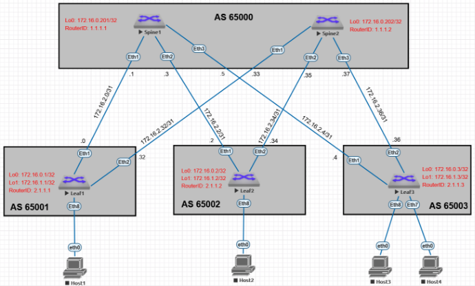

# Оглавление
[**План работы**](#_toc188194583)

[**Топология лабораторного стенда**](#_toc188194584)

[**Настройка Underlay. EBGP**](#_toc188194585)

[**Настройка параметров BGP**](#_toc188194586)

[Настройка коммутаторов SPINE](#_toc188194587)

[Настройка коммутаторов LEAF](#_toc188194588)

[**Проверка корректности работы BGP**](#_toc188194589)

[**Настройка BFD**](#_toc188194590)

[**Проверка BFD**](#_toc188194591)


# <a name="_toc188194583"></a>**План работы**

1. Настроить протокол BGP - глобальные параметры
1. Настроить BFD на PtP интерфейсах, проверить корректность
1. Проверить наличие префиксов, полученных по BGP, проверить доступность узлов 
1. Задокументировать результаты работы

# <a name="_toc188194584"></a>**Топология лабораторного стенда**




# <a name="_toc188194585"></a>**Настройка Underlay. EBGP**

## <a name="_toc188194586"></a>**Настройка параметров BGP**

## <a name="_toc188194587"></a>Настройка коммутаторов SPINE
**`router bgp 65000         `**	- запускаем процесс BGP с указанием ASN. В случае использования при построении Underlay протокола eBGP, рекомендовано каждый коммутатор LEAF помещать в отдельную AS, а все SPINE в пределах POD объединять в общую AS.

**`router-id 1.1.1.2        `**	- настройка RID. Для каждого коммутатора должен быть уникальным. В данной работе RID для коммутаторов SPINE принимает значения 1.1.1.0/8, для LEAF – 2.1.1.0/8

**`timers bgp 3 9           `**	- настройка таймеров BGP для более быстрой сходимости

**`maximum-paths 10         `**	- максимальное количество равнозначных маршрутов для ECMP

**`bgp listen range 172.16.2.0/24 peer-group POD-1\_P2P peer-filter LEAVES\_ASN                                              `**	- настройка динамической группы пиров, с которыми будет устанавливаться соседство. 

  **`peer-filter LEAVES_ASN  `**	- настройка фильтра для входящих ASN при установлении BGP соседства. Используется для динамического пиринга

**`match as-range 65001-65003 result accept                                                                                  `** - принимать при попадании ASN  в диапазон

## <a name="_toc188194588"></a>Настройка коммутаторов LEAF

**`router bgp 65001`**

  **`  router-id 2.1.1.1`**

   **`  timers bgp 5 15`**

  **`  maximum-paths 10`**

  **`  neighbor 172.16.2.1 remote-as 65000`**	- указываем соседей (все коммутаторы SPINE) статически

  **`  neighbor 172.16.2.33 remote-as 65000`**

  **`  network 172.16.0.1/32                `**			- указываем анонсируемые префиксы (Loopback 0)

# <a name="_toc188194589"></a>**Проверка корректности работы BGP**

```
spine-1#sh ip bgp sum

BGP summary information for VRF default

Router identifier 1.1.1.1, local AS number 65000

Neighbor Status Codes: m - Under maintenance

    Neighbor         V  AS           MsgRcvd   MsgSent  InQ OutQ  Up/Down State   PfxRcd PfxAcc

    172.16.2.0       4  65001           2679      2678    0    0 03:42:33 Estab   1      1

    172.16.2.2       4  65002           4459      4461    0    0 03:42:33 Estab   1      1

    172.16.2.4       4  65003           4355      4355    0    0 03:37:21 Estab   1      1

spine-1#

```
```
spine-2#sh ip bgp det

BGP routing table information for VRF default

Router identifier 1.1.1.2, local AS number 65000

BGP routing table entry for 172.16.0.1/32

   Paths: 1 available

    65001

      172.16.2.32 from 172.16.2.32 (2.1.1.1)

        Origin IGP, metric 0, localpref 100, IGP metric 1, weight 0, received 01:01:17 ago, valid, external, best

        Rx SAFI: Unicast

BGP routing table entry for 172.16.0.2/32

   Paths: 1 available

    65002

      172.16.2.34 from 172.16.2.34 (2.1.1.2)

        Origin IGP, metric 0, localpref 100, IGP metric 1, weight 0, received 2d23h ago, valid, external, best

        Rx SAFI: Unicast

BGP routing table entry for 172.16.0.3/32

   Paths: 1 available

    65003

      172.16.2.36 from 172.16.2.36 (2.1.1.3)

        Origin IGP, metric 0, localpref 100, IGP metric 1, weight 0, received 03:45:27 ago, valid, external, best

        Rx SAFI: Unicast

spine-2#
```
```
leaf-1#sh ip bgp neighbors 

BGP neighbor is 172.16.2.1, remote AS 65000, external link

    BGP version 4, remote router ID 1.1.1.1, VRF default

    Negotiated BGP version 4

    Member of update group 2

    Last read 00:00:03, last write 00:00:03

    Hold time is 15, keepalive interval is 5 seconds

    Configured hold time is 15, keepalive interval is 5 seconds

    Connect timer is inactive

    Idle-restart timer is inactive

    BGP state is Established, up for 03:45:03

    Number of transitions to established: 5

    Last state was OpenConfirm

    Last event was RecvKeepAlive

    Last sent notification:Cease/other configuration change, Last time    2d00h

    Last rcvd notification:Cease/peer de-configured, Last time 03:45:38

    Neighbor Capabilities:

      Multiprotocol IPv4 Unicast: advertised and received and negotiated

      Four Octet ASN: advertised and received and negotiated

      Route Refresh: advertised and received and negotiated

      Send End-of-RIB messages: advertised and received and negotiated

      Additional-paths recv capability:

        IPv4 Unicast: advertised

      Additional-paths send capability:

        IPv4 Unicast: received

    Restart timer is inactive

    End of rib timer is inactive

    Message Statistics:

      InQ depth is 0

      OutQ depth is 0

                           Sent      Rcvd

      Opens:                  5         5

      Notifications:          3         1

      Updates:               16        13

      Keepalives:         52127     52127

      Route-Refresh:          0         0

      Total messages:     52151     52146

    Prefix Statistics:

                           Sent      Rcvd     Best Paths     Best ECMP Paths

      IPv4 Unicast:           3         2              0                   2

      IPv6 Unicast:           0         0              0                   0

      IPv4 SR-TE:             0         0              0                   0

      IPv6 SR-TE:             0         0              0                   0

    Inbound updates dropped by reason:

      AS path loop detection: 0

      Enforced First AS: 0

      Originator ID matches local router ID: 0

      Nexthop matches local IP address: 0

      Unexpected IPv6 nexthop for IPv4 routes: 0

      Nexthop invalid for single hop eBGP: 0

    Inbound updates with attribute errors:

      Resulting in removal of all paths in update (treat-as-withdraw): 0

      Resulting in AFI/SAFI disable: 0

      Resulting in attribute ignore: 0

    Inbound paths dropped by reason:

      IPv4 labeled-unicast NLRIs dropped due to excessive labels: 0

      IPv6 labeled-unicast NLRIs dropped due to excessive labels: 0

    Outbound paths dropped by reason:

      IPv4 local address not available: 0

      IPv6 local address not available: 0

      Inbound policy

      Outbound policy

Local AS is 65001, local router ID 2.1.1.1

TTL is 1

Local TCP address is 172.16.2.0, local port is 37699

Remote TCP address is 172.16.2.1, remote port is 179

Auto-Local-Addr is disabled

Bfd is enabled and state is Up

TCP Socket Information:

    TCP state is ESTABLISHED

    Recv-Q: 0/32768

    Send-Q: 0/32768

    Outgoing Maximum Segment Size (MSS): 7948

    Total Number of TCP retransmissions: 0

    Options:

      Timestamps enabled: yes

      Selective Acknowledgments enabled: yes

      Window Scale enabled: yes

      Explicit Congestion Notification (ECN) enabled: no

    Socket Statistics:

      Window Scale (wscale): 7,7

      Retransmission Timeout (rto): 224.0ms

      Round-trip Time (rtt/rtvar): 20.1ms/3.1ms

      Delayed Ack Timeout (ato): 40.0ms

      Congestion Window (cwnd): 10

      TCP Throughput: 31.69 Mbps

      Advertised Recv Window (rcv\_space): 63680


BGP neighbor is 172.16.2.33, remote AS 65000, external link

    BGP version 4, remote router ID 1.1.1.2, VRF default

    Negotiated BGP version 4

    Member of update group 2

    Last read never, last write never

    Hold time is 9, keepalive interval is 3 seconds

    Configured hold time is 15, keepalive interval is 5 seconds

    Connect timer is inactive

    Idle-restart timer is inactive

    BGP state is Established, up for    1d13h

    Number of transitions to established: 6

    Last state was OpenConfirm

    Last event was RecvKeepAlive

    Last sent notification:Cease/other configuration change, Last time    2d00h

    Last rcvd notification:Cease/other configuration change, Last time    1d13h, First time    2d21h, Repeats 1

    Neighbor Capabilities:

      Multiprotocol IPv4 Unicast: advertised and received and negotiated

      Four Octet ASN: advertised and received and negotiated

      Route Refresh: advertised and received and negotiated

      Send End-of-RIB messages: advertised and received and negotiated

      Additional-paths recv capability:

        IPv4 Unicast: advertised

      Additional-paths send capability:

        IPv4 Unicast: received

    Restart timer is inactive

    End of rib timer is inactive

    Message Statistics:

      InQ depth is 0

      OutQ depth is 0

                           Sent      Rcvd

      Opens:                  6         6

      Notifications:          2         3

      Updates:               23        11

      Keepalives:         86345     86345

      Route-Refresh:          0         0

      Total messages:     86376     86365

    Prefix Statistics:

                           Sent      Rcvd     Best Paths     Best ECMP Paths

      IPv4 Unicast:           1         2              2                   2

      IPv6 Unicast:           0         0              0                   0

      IPv4 SR-TE:             0         0              0                   0

      IPv6 SR-TE:             0         0              0                   0

    Inbound updates dropped by reason:

      AS path loop detection: 0

      Enforced First AS: 0

      Originator ID matches local router ID: 0

      Nexthop matches local IP address: 0

      Unexpected IPv6 nexthop for IPv4 routes: 0

      Nexthop invalid for single hop eBGP: 0

    Inbound updates with attribute errors:

      Resulting in removal of all paths in update (treat-as-withdraw): 0

      Resulting in AFI/SAFI disable: 0

      Resulting in attribute ignore: 0

    Inbound paths dropped by reason:

      IPv4 labeled-unicast NLRIs dropped due to excessive labels: 0

      IPv6 labeled-unicast NLRIs dropped due to excessive labels: 0

    Outbound paths dropped by reason:

      IPv4 local address not available: 0

      IPv6 local address not available: 0

      Inbound policy

      Outbound policy

Local AS is 65001, local router ID 2.1.1.1

TTL is 1

Local TCP address is 172.16.2.32, local port is 40551

Remote TCP address is 172.16.2.33, remote port is 179

Auto-Local-Addr is disabled

Bfd is enabled and state is Up

TCP Socket Information:

    TCP state is ESTABLISHED

    Recv-Q: 0/32768

    Send-Q: 0/32768

    Outgoing Maximum Segment Size (MSS): 7948

    Total Number of TCP retransmissions: 0

    Options:

      Timestamps enabled: yes

      Selective Acknowledgments enabled: yes

      Window Scale enabled: yes

      Explicit Congestion Notification (ECN) enabled: no

    Socket Statistics:

      Window Scale (wscale): 7,7

      Retransmission Timeout (rto): 216.0ms

      Round-trip Time (rtt/rtvar): 15.1ms/3.1ms

      Delayed Ack Timeout (ato): 40.0ms

      Congestion Window (cwnd): 10

      TCP Throughput: 42.23 Mbps

      Recv Round-trip Time (rcv\_rtt): 383323.2ms

      Advertised Recv Window (rcv\_space): 63799
```
```
leaf-2#sh ip bgp det

BGP routing table information for VRF default

Router identifier 2.1.1.2, local AS number 65002

BGP routing table entry for 172.16.0.1/32

   Paths: 2 available

    65000 65001

      172.16.2.3 from 172.16.2.3 (1.1.1.1)

        Origin IGP, metric 0, localpref 100, IGP metric 1, weight 0, received 00:58:05 ago, valid, external, ECMP head, best, ECMP contributor

        Rx SAFI: Unicast

    65000 65001

      172.16.2.35 from 172.16.2.35 (1.1.1.2)

        Origin IGP, metric 0, localpref 100, IGP metric 1, weight 0, received 00:58:04 ago, valid, external, ECMP, ECMP contributor

        Rx SAFI: Unicast

BGP routing table entry for 172.16.0.2/32

   Paths: 1 available

    Local

      - from - (2.1.1.2)

        Origin IGP, metric 0, localpref 0, IGP metric -, weight -, received 3d22h ago, valid, local, best, redistributed (Connected)

        Rx SAFI: Unicast

BGP routing table entry for 172.16.0.3/32

   Paths: 2 available

    65000 65003

      172.16.2.35 from 172.16.2.35 (1.1.1.2)

        Origin IGP, metric 0, localpref 100, IGP metric 1, weight 0, received 03:42:15 ago, valid, external, ECMP head, best, ECMP contributor

        Rx SAFI: Unicast

    65000 65003

      172.16.2.3 from 172.16.2.3 (1.1.1.1)

        Origin IGP, metric 0, localpref 100, IGP metric 1, weight 0, received 03:41:52 ago, valid, external, ECMP, ECMP contributor

        Rx SAFI: Unicast

leaf-2#
```
```
Трассировка маршрута к интерфейсу Loopback0 на Leaf-3

leaf-1#sh ip ro 172.16.0.3

VRF: default

Codes: C - connected, S - static, K - kernel, 

         O - OSPF, IA - OSPF inter area, E1 - OSPF external type 1,

         E2 - OSPF external type 2, N1 - OSPF NSSA external type 1,

         N2 - OSPF NSSA external type2, B - Other BGP Routes,

         B I - iBGP, B E - eBGP, R - RIP, I L1 - IS-IS level 1,

         I L2 - IS-IS level 2, O3 - OSPFv3, A B - BGP Aggregate,

         A O - OSPF Summary, NG - Nexthop Group Static Route,

         V - VXLAN Control Service, M - Martian,

         DH - DHCP client installed default route,

         DP - Dynamic Policy Route, L - VRF Leaked,

         G  - gRIBI, RC - Route Cache Route

   B E      172.16.0.3/32 [200/0] via 172.16.2.1, Ethernet1

                                  via 172.16.2.33, Ethernet2

leaf-1#trace 172.16.0.3 so 172.16.0.1

traceroute to 172.16.0.3 (172.16.0.3), 30 hops max, 60 byte packets

   1  172.16.2.1 (172.16.2.1)  19.983 ms  68.761 ms  64.435 ms
   2  172.16.0.3 (172.16.0.3)  68.268 ms  76.432 ms  81.858 ms

leaf-1#
```
```
Трассировка маршрута к интерфейсу Loopback0 на Leaf-2

leaf-3#sh ip ro 172.16.0.2

VRF: default

Codes: C - connected, S - static, K - kernel, 

         O - OSPF, IA - OSPF inter area, E1 - OSPF external type 1,

         E2 - OSPF external type 2, N1 - OSPF NSSA external type 1,

         N2 - OSPF NSSA external type2, B - Other BGP Routes,

         B I - iBGP, B E - eBGP, R - RIP, I L1 - IS-IS level 1,

         I L2 - IS-IS level 2, O3 - OSPFv3, A B - BGP Aggregate,

         A O - OSPF Summary, NG - Nexthop Group Static Route,

         V - VXLAN Control Service, M - Martian,

         DH - DHCP client installed default route,

         DP - Dynamic Policy Route, L - VRF Leaked,

         G  - gRIBI, RC - Route Cache Route

   B E      172.16.0.2/32 [200/0] via 172.16.2.5, Ethernet1

                                  via 172.16.2.37, Ethernet2

leaf-3#trace 172.16.0.2 so 172.16.0.3
traceroute to 172.16.0.2 (172.16.0.2), 30 hops max, 60 byte packets
   1  172.16.2.5 (172.16.2.5)  44.797 ms  73.428 ms  84.604 ms
   2  172.16.0.2 (172.16.0.2)  88.777 ms  98.132 ms  101.068 ms
leaf-3#
```
# **Настройка BFD**

Для настройки BFD для BGP процесса выполнить команды:

**`interface Ethernet1 – Ethernet3         `**		- режим настройки интерфейсов

**`bfd interval 100 min-rx 100 multiplier 3`**		- настройка интервалов проверок связности между пирами и число неуспешных проверок для определения неработоспособности линка

**`router bgp 65000                        `**		- режим настройки процесса BGP

**`neighbor POD-1_P2P bfd                  `**		- включение BFD для каждого соседа (пир-группы, либо статического)

**`neighbor 172.16.2.33 bfd`**


## <a name="_toc188194591"></a>**Проверка BFD**
```
leaf-3#sh bfd peer

VRF name: default

-----------------

DstAddr         MyDisc   YourDisc  Interface/Transport    Type          LastUp 

----------- ---------- ----------- -------------------- ------- ---------------

172.16.2.5   521448589 3986240316        Ethernet1(13)  normal  01/19/25 10:24 

172.16.2.37 3471083298 3921916337        Ethernet2(14)  normal  01/19/25 10:24 

           LastDown            LastDiag    State

-------------------- ------------------- -----

     01/19/25 10:24       No Diagnostic       Up

                 NA       No Diagnostic       Up
leaf-3#
```
```
leaf-2#sh ip bgp nei bfd

BGP BFD Neighbor Table

Flags: U - BFD is enabled for BGP neighbor and BFD session state is UP

         I - BFD is enabled for BGP neighbor and BFD session state is INIT

         D - BFD is enabled for BGP neighbor and BFD session state is DOWN

         N - BFD is not enabled for BGP neighbor

Neighbor           Interface          Up/Down    State       Flags

172.16.2.3         Ethernet1          04:00:21   Established U    

172.16.2.35        Ethernet2          2d23h      Established U    

leaf-2#
```
```
spine-2#sh ip bgp nei bfd

BGP BFD Neighbor Table

Flags: U - BFD is enabled for BGP neighbor and BFD session state is UP

         I - BFD is enabled for BGP neighbor and BFD session state is INIT

         D - BFD is enabled for BGP neighbor and BFD session state is DOWN

         N - BFD is not enabled for BGP neighbor

Neighbor           Interface          Up/Down    State       Flags

172.16.2.32        Ethernet1          1d13h      Established U    

172.16.2.34        Ethernet2          2d23h      Established U    

172.16.2.36        Ethernet3          2d23h      Established U    

spine-2#

