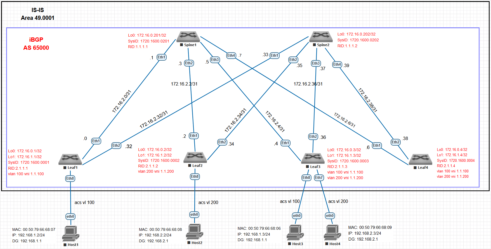

# Оглавление
[**План работы**](#_toc189151842)

[**Топология лабораторного стенда**](#_toc189151843)

[**Настройка IS-IS underlay**](#_toc189151844)

[**Настройка глобальных параметров IS-IS**](#_toc189151845)

[**Настройка параметров интерфейсов IS-IS**](#_toc189151846)

[Настройки на SPINE (Пример Spine-1)](#_toc189151847)

[**Настройка iBGP EVPN overlay**](#_toc189151848)

[Настройка коммутаторов SPINE (На примере Spine-1)](#_toc189151849)

[Настройка коммутаторов LEAF  (На примере Leaf-3)](#_toc189151850)

[Проверка корректности работы BGP](#_toc189151851)

[**Настройка VXLAN (На примере Leaf-3)**](#_toc189151852)

[Проверка VXLAN](#_toc189151853)

[Проверка VXLAN EVPN](#_toc189151854)

[Проверка информации, полученной в EVPN](#_toc189151855)

[Проверка L2 связности между хостами](#_toc189151856)

[**Настройка Anycast gateway (На примере Leaf-3)**](#_toc189151857)

[Проверка anicast gateway](#_toc189151858)


# <a name="_toc189151842"></a>**План работы**

1. Настроить протокол IS-IS на underlay
1. Настроить протокол iBGP на EVPN overlay в AF l2vpn evpn (MAC VRF)
1. Настроить VXLAN
1. Проверить L2 связанность между клиентами, подключенными к различным LEAF
1. Настроить Anycast gateway
1. Проверить L3 связанность между клиентами, подключенными к различным VLAN
1. Задокументировать результаты работы

# <a name="_toc189151843"></a>**Топология лабораторного стенда**


# <a name="_toc189151844"></a>**Настройка IS-IS underlay**

## <a name="_toc188185508"></a><a name="_toc189151845"></a>**Настройка глобальных параметров IS-IS**

**`router isis 100              `**			- запускаем процесс IS-IS

**`net 49.0001.1720.1600.0001.00`**	- в качестве SysID в NET (Network Entity Title) используем преобразованный IP-адрес интерфейса Lo0, уникальный для каждого коммутатора. В данном примере использован адрес Lo0 коммутатора leaf-1 (172.16.0.1). Поле AFI для локальных сетей принимает значение 49, AreaID – 0001, SEL – 00.

**`is-hostname LEAF-1           `**	- опциональное значение hostname, выводимое в некоторых `                                   `случаях вместо SysID

**`is-type level-1              `**	- явно указываем уровень IS (роутера) для минимизации `                                        `служебного трафика

**`address-family ipv4 unicast  `**		- указываем какой IP протокол будем маршрутизировать

**`log-adjacency-change         `**			- логирование сообщений об изменениях соседства

## <a name="_toc188185509"></a><a name="_toc189151846"></a>**Настройка параметров интерфейсов IS-IS**

**`interface Ethernet1          `**			- режим конфигурирования интерфейса

**`isis network point-to-point  `**		- тип сети указываем явно на PtP стыках коммутаторов

**`isis enable 100              `**			- включаем интерфейс в настроенный процесс IS-IS

## <a name="_toc189151847"></a>Настройки на SPINE (Пример Spine-1)

```
interface Ethernet1

     description ULP2P\_Leaf-1/Eth1

     mtu 8000

     no switchport

     ip address 172.16.2.1/31

     isis enable 100

     isis network point-to-point

     isis authentication mode md5

     isis authentication key 7 kxO/T7mE222MI7GjFWg5CQ==

!

interface Ethernet2

     description ULP2P\_Leaf-2/Eth1

     mtu 8000

     no switchport

     ip address 172.16.2.3/31

     isis enable 100

     isis network point-to-point

     isis authentication mode md5

     isis authentication key 7 kxO/T7mE222MI7GjFWg5CQ==

!

interface Ethernet3

     description ULP2P\_Leaf-3/Eth1

     mtu 8000

     no switchport

     ip address 172.16.2.5/31

     isis enable 100

     isis network point-to-point

     isis authentication mode md5

     isis authentication key 7 kxO/T7mE222MI7GjFWg5CQ==

!

interface Ethernet4

     description ULP2P\_Leaf-4/Eth1

     mtu 8000

     no switchport

     ip address 172.16.2.7/31

     isis enable 100

     isis network point-to-point

     isis authentication mode md5

     isis authentication key 7 kxO/T7mE222MI7GjFWg5CQ==

!

interface Loopback0

     ip address 172.16.0.201/32

     isis enable 100

!

ip routing

!

router isis 100

     net 49.0001.1720.1600.0201.00

     is-hostname SPINE-1

     is-type level-1

     log-adjacency-changes

     authentication mode md5

     authentication key 7 kxO/T7mE222MI7GjFWg5CQ==

     !

     address-family ipv4 unicast

        bfd all-interfaces

!
```
Настройки Underlay на остальных коммутаторах (LEAF и SPINE) аналогичны

# <a name="_toc189151848"></a>**Настройка iBGP EVPN overlay**

**`service routing protocols model multi-agent`**	- включение EVPN Control plane выполняется на всех коммутаторах

## <a name="_toc189151849"></a>Настройка коммутаторов SPINE (На примере Spine-1)

**`router bgp 65000         `**	- запускаем процесс BGP с указанием ASN. При построении Underlay `                           `протокола iBGP, все коммутаторы POD размещаются в общую AS.

**`router-id 1.1.1.1        `**	- настройка RID. Для каждого коммутатора должен быть уникальным. `                           `В данной работе RID для коммутаторов SPINE принимает значения `                              `1.1.1.0/8, для LEAF – 2.1.1.0/8

**`timers bgp 3 9           `**	- настройка таймеров BGP для более быстрой сходимости

**`maximum-paths 10         `**	- максимальное количество равнозначных маршрутов для ECMP

**`bgp listen range 172.16.2.0/24 peer-group POD-1_EVPN remote-as 65000`**

`                           `- настройка динамической группы пиров, с которыми будет `                                     `устанавливаться соседство. 

**`neighbor POD-1_EVPN update-source Loopback0`**

`                           `- указываем интерфейс, от которого устанавливается соседство и `                                `отправляются bgp update

**`neighbor POD-1_EVPN allowas-in 3`**

`                           `- разрешаем прием входящих update, содержащие локальный ASN

**`neighbor POD-1_EVPN route-reflector-client`** 

`                           `- включаем функцию ROUTE REFLECTOR в сторону соседа

**`neighbor POD-1_EVPN send-community extended`**

`                           `- включаем отправку параметра extended community в отсылаемых `                              `соседу анонсах

**`neighbor POD-1_EVPN maximum-routes 12000 warning-only`**

`                           `- указываем максимальное количество маршрутов, которые BGP примет для установки в RIB. Если значение не указано, по умолчанию устанавливается «неограниченное»

**`address-family evpn         `**

**`neighbor POD-1_EVPN activate`**	- включаем обмен маршрутной информацией EVPN с BGP `                                      `соседями

!

## <a name="_toc189151850"></a>Настройка коммутаторов LEAF  (На примере Leaf-3)
```
router bgp 65000

     router-id 2.1.1.3

     timers bgp 3 9

     maximum-paths 10

     neighbor POD-1_EVPN peer group

     neighbor POD-1_EVPN remote-as 65000

     neighbor POD-1_EVPN update-source Loopback0

     neighbor POD-1_EVPN allowas-in 3

     neighbor POD-1_EVPN send-community extended

     neighbor POD-1_EVPN maximum-routes 12000 warning-only
```
`      neighbor 172.16.0.201 peer group POD-1_EVPN`	- указываем соседей (все коммутаторы SPINE) `                                                   `статически

`neighbor 172.16.0.202 peer group POD-1_EVPN`

`vlan 100                                  `						- настраиваем MAC-VRF для передачи трафика VLAN

`      rd auto                               `						- автоматическое назначение ROUTE DISTIGUISHER

`     route-target both 65000:100            `	- принимать и передавать префиксы с данным RT в `                                            `BGP EXTENDED COMUNITY

`    redistribute learned                    `				- распространять изученные MAC-IP префиксы
```
     vlan 200

        rd auto

        route-target both 65000:200

        redistribute learned

     !
```
```
address-family evpn

neighbor POD-1_EVPN activate
```
`                           `- включаем обмен маршрутной информацией EVPN с BGP соседями
```
     address-family ipv4

        network 172.16.1.3/32
```
`                           `- анонсируем в BGP интерфейс для построения туннелей с VTEP (Loopback 1)


## <a name="_toc189151851"></a>Проверка работы BGP

```
leaf-3#sh ip bgp sum

BGP summary information for VRF default

Router identifier 2.1.1.3, local AS number 65000

Neighbor Status Codes: m - Under maintenance

    Neighbor     V AS           MsgRcvd   MsgSent  InQ OutQ  Up/Down State   PfxRcd PfxAcc

    172.16.0.201 4 65000         130434    130285    0    0    3d20h Estab   2      2

    172.16.0.202 4 65000         130357    130385    0    0    3d20h Estab   2      2

Установлено соседство с коммутаторами SPINE

--------------------------------------------------------

leaf-3#sh ip route bgp

VRF: default

Codes: C - connected, S - static, K - kernel, 

         O - OSPF, IA - OSPF inter area, E1 - OSPF external type 1,

         E2 - OSPF external type 2, N1 - OSPF NSSA external type 1,

         N2 - OSPF NSSA external type2, B - Other BGP Routes,

         B I - iBGP, B E - eBGP, R - RIP, I L1 - IS-IS level 1,

         I L2 - IS-IS level 2, O3 - OSPFv3, A B - BGP Aggregate,

         A O - OSPF Summary, NG - Nexthop Group Static Route,

         V - VXLAN Control Service, M - Martian,

         DH - DHCP client installed default route,

         DP - Dynamic Policy Route, L - VRF Leaked,

         G  - gRIBI, RC - Route Cache Route
```
`B I      172.16.1.1/32 [200/0] via 172.16.2.5, Ethernet1           `		- хост-префиксы loopback1 коммутаторов 								Leaf-1 и Leaf-2 получены по BGP
```
              			      via 172.16.2.37, Ethernet2

B I     172.16.1.2/32 [200/0] via 172.16.2.5, Ethernet1

            			      via 172.16.2.37, Ethernet2
```
# <a name="_toc189151852"></a>**Настройка VXLAN (На примере Leaf-3)**

**`vxlan vni notation dotted           `**		- настройка формата представления номеров VNI с точками для удобства чтения

**`interface Vxlan1                    `**

**`vxlan source-interface Loopback1    `**		- интерфейс для построения VXLAN туннелей

**`vxlan udp-port 4789                 `** - порт UDP для приема VXLAN пакетов

**`vxlan flood vtep learned data-plane `**		- список VTEP для установления VXLAN туннелей `                                                `формируется изучением входящего VXLAN трафика

**`vxlan vlan 100 vni 1.1.100          `**			- мапинг VLAN к VNI

**`vxlan vlan 200 vni 1.1.200          `**

## <a name="_toc189151853"></a>Проверка VXLAN

```
leaf-1#sh vxlan vtep det

Remote VTEPS for Vxlan1:

VTEP             Learned Via         MAC Address Learning       Tunnel Type(s)

---------------- ------------------- -------------------------- --------------

172.16.1.2       control plane       control plane              flood         

172.16.1.3       control plane       control plane              flood         

----------------------------------------------
```
```
leaf-2#sh vxlan vtep det

Remote VTEPS for Vxlan1:

VTEP             Learned Via         MAC Address Learning       Tunnel Type(s)

---------------- ------------------- -------------------------- --------------

172.16.1.1       control plane       control plane              flood         

172.16.1.3       control plane       control plane              flood         

Total number of remote VTEPS:  2

----------------------------------------------
```
```
leaf-3#sh vxlan vtep det

Remote VTEPS for Vxlan1:

VTEP             Learned Via         MAC Address Learning       Tunnel Type(s)

---------------- ------------------- -------------------------- --------------

172.16.1.1       control plane       control plane              flood         

172.16.1.2       control plane       control plane              flood         

-----------------------------------------------
```
Все коммутаторы LEAF обнаружили остальные VTEP для установления VXLAN туннелей


## <a name="_toc189151855"></a>Проверка информации, полученной в EVPN
```
leaf-3#show bgp evpn instance

EVPN instance: VLAN 100

    Route distinguisher: 0:0

    Route target import: Route-Target-AS:65000:100

    Route target export: Route-Target-AS:65000:100

    Service interface: VLAN-based

    Local VXLAN IP address: 172.16.1.3

    VXLAN: enabled

    MPLS: disabled

EVPN instance: VLAN 200

    Route distinguisher: 0:0

    Route target import: Route-Target-AS:65000:200

    Route target export: Route-Target-AS:65000:200

    Service interface: VLAN-based

    Local VXLAN IP address: 172.16.1.3

    VXLAN: enabled

    MPLS: disabled

------------------------------------------------------------
```
```
leaf-3#sh mac address-table

                    Mac Address Table

------------------------------------------------------------------

Vlan    Mac Address       Type        Ports      Moves   Last Move

----    -----------       ----        -----      -----   ---------

   100    0050.7966.6806    DYNAMIC     Et8        1       0:00:33 ago

   100    0050.7966.6807    DYNAMIC     Vx1        1       0:00:34 ago

   200    0050.7966.6808    DYNAMIC     Vx1        1       0:00:34 ago

   200    0050.7966.6809    DYNAMIC     Et7        1       0:00:30 ago

Total Mac Addresses for this criterion: 4
```
```
leaf-1#sh bgp evpn instance 

EVPN instance: VLAN 100

    Route distinguisher: 0:0

    Route target import: Route-Target-AS:65000:100

    Route target export: Route-Target-AS:65000:100

    Service interface: VLAN-based

    Local VXLAN IP address: 172.16.1.1

    VXLAN: enabled

    MPLS: disabled

------------------------------------------------------------
```
```
leaf-1#sh mac address-table 

                    Mac Address Table

------------------------------------------------------------------

Vlan    Mac Address       Type        Ports      Moves   Last Move

----    -----------       ----        -----      -----   ---------

   100    0050.7966.6806    DYNAMIC     Vx1        1       0:01:59 ago

   100    0050.7966.6807    DYNAMIC     Et8        1       0:02:01 ago

Total Mac Addresses for this criterion: 2

                    Multicast Mac Address Table

------------------------------------------------------------------

Vlan    Mac Address       Type        Ports

----    -----------       ----        -----

Total Mac Addresses for this criterion: 0

------------------------------------------------------------------------
```
```
leaf-1#sh bgp evpn

BGP routing table information for VRF default

Router identifier 2.1.1.1, local AS number 65000

Route status codes: * - valid, > - active, S - Stale, E - ECMP head, e - ECMP

                      c - Contributing to ECMP, % - Pending BGP convergence

Origin codes: i - IGP, e - EGP, ? - incomplete

AS Path Attributes: Or-ID - Originator ID, C-LST - Cluster List, LL Nexthop - Link Local Nexthop

                    Network                Next Hop              Metric  LocPref Weight  Path

   * >Ec    RD: 2.1.1.3:100 mac-ip 0050.7966.6806

                                   172.16.1.3            -       100     0       i Or-ID: 2.1.1.3 C-LST: 1.1.1.2 

   *  ec    RD: 2.1.1.3:100 mac-ip 0050.7966.6806

                                   172.16.1.3            -       100     0       i Or-ID: 2.1.1.3 C-LST: 1.1.1.1 

   * >Ec    RD: 2.1.1.3:100 mac-ip 0050.7966.6806 192.168.1.3

                                   172.16.1.3            -       100     0       i Or-ID: 2.1.1.3 C-LST: 1.1.1.2 

   *  ec    RD: 2.1.1.3:100 mac-ip 0050.7966.6806 192.168.1.3

                                   172.16.1.3            -       100     0       i Or-ID: 2.1.1.3 C-LST: 1.1.1.1 

   * >      RD: 2.1.1.1:100 mac-ip 0050.7966.6807

                                   -                     -       -       0       i

   * >      RD: 2.1.1.1:100 mac-ip 0050.7966.6807 192.168.1.2

                                   -                     -       -       0       i

   * >Ec    RD: 2.1.1.2:200 mac-ip 0050.7966.6808

                                   172.16.1.2            -       100     0       i Or-ID: 2.1.1.2 C-LST: 1.1.1.2 

   *  ec    RD: 2.1.1.2:200 mac-ip 0050.7966.6808

                                   172.16.1.2            -       100     0       i Or-ID: 2.1.1.2 C-LST: 1.1.1.1 

   * >Ec    RD: 2.1.1.3:200 mac-ip 0050.7966.6809

                                   172.16.1.3            -       100     0       i Or-ID: 2.1.1.3 C-LST: 1.1.1.2 

   *  ec    RD: 2.1.1.3:200 mac-ip 0050.7966.6809

                                   172.16.1.3            -       100     0       i Or-ID: 2.1.1.3 C-LST: 1.1.1.1 

   * >Ec    RD: 2.1.1.3:200 mac-ip 0050.7966.6809 192.168.2.3

                                   172.16.1.3            -       100     0       i Or-ID: 2.1.1.3 C-LST: 1.1.1.2 

   *  ec    RD: 2.1.1.3:200 mac-ip 0050.7966.6809 192.168.2.3

                                   172.16.1.3            -       100     0       i Or-ID: 2.1.1.3 C-LST: 1.1.1.1 

   * >      RD: 2.1.1.1:100 imet 172.16.1.1

                                   -                     -       -       0       i

   * >Ec    RD: 2.1.1.2:200 imet 172.16.1.2

                                   172.16.1.2            -       100     0       i Or-ID: 2.1.1.2 C-LST: 1.1.1.2 

   *  ec    RD: 2.1.1.2:200 imet 172.16.1.2

                                   172.16.1.2            -       100     0       i Or-ID: 2.1.1.2 C-LST: 1.1.1.1 

   * >Ec    RD: 2.1.1.3:100 imet 172.16.1.3

                                   172.16.1.3            -       100     0       i Or-ID: 2.1.1.3 C-LST: 1.1.1.1 

   *  ec    RD: 2.1.1.3:100 imet 172.16.1.3

                                   172.16.1.3            -       100     0       i Or-ID: 2.1.1.3 C-LST: 1.1.1.2 

   * >Ec    RD: 2.1.1.3:200 imet 172.16.1.3

                                   172.16.1.3            -       100     0       i Or-ID: 2.1.1.3 C-LST: 1.1.1.2 

   *  ec    RD: 2.1.1.3:200 imet 172.16.1.3

                                   172.16.1.3            -       100     0       i Or-ID: 2.1.1.3 C-LST: 1.1.1.1 

------------------------------------------------------------
```
```
leaf-3#show bgp evpn route-type mac-ip

BGP routing table information for VRF default

Router identifier 2.1.1.3, local AS number 65000

Route status codes: * - valid, > - active, S - Stale, E - ECMP head, e - ECMP

                      c - Contributing to ECMP, % - Pending BGP convergence

Origin codes: i - IGP, e - EGP, ? - incomplete

AS Path Attributes: Or-ID - Originator ID, C-LST - Cluster List, LL Nexthop - Link Local Nexthop

                    Network                Next Hop              Metric  LocPref Weight  Path

   * >      RD: 2.1.1.3:100 mac-ip 0050.7966.6806

                                   -                     -       -       0       i

   * >Ec    RD: 2.1.1.1:100 mac-ip 0050.7966.6807

                                   172.16.1.1            -       100     0       i Or-ID: 2.1.1.1 C-LST: 1.1.1.2 

   *  ec    RD: 2.1.1.1:100 mac-ip 0050.7966.6807

                                   172.16.1.1            -       100     0       i Or-ID: 2.1.1.1 C-LST: 1.1.1.1 

   * >Ec    RD: 2.1.1.2:200 mac-ip 0050.7966.6808

                                   172.16.1.2            -       100     0       i Or-ID: 2.1.1.2 C-LST: 1.1.1.1 

   *  ec    RD: 2.1.1.2:200 mac-ip 0050.7966.6808

                                   172.16.1.2            -       100     0       i Or-ID: 2.1.1.2 C-LST: 1.1.1.2 

   * >      RD: 2.1.1.3:200 mac-ip 0050.7966.6809

                                   -                     -       -       0       i

   ------------------------------------------------------------
```
```
leaf-3#show bgp evpn route-type imet detail 

BGP routing table information for VRF default

Router identifier 2.1.1.3, local AS number 65000

BGP routing table entry for imet 172.16.1.1, Route Distinguisher: 2.1.1.1:100

   Paths: 2 available

    Local

      172.16.1.1 from 172.16.0.201 (1.1.1.1)

        Origin IGP, metric -, localpref 100, weight 0, tag 0, valid, internal, ECMP head, ECMP, best, ECMP contributor

        Originator: 2.1.1.1, Cluster list: 1.1.1.1 

        Extended Community: Route-Target-AS:65000:100 TunnelEncap:tunnelTypeVxlan

        VNI: 1.1.100

        PMSI Tunnel: Ingress Replication, MPLS Label: 65892, Leaf Information Required: false, Tunnel ID: 172.16.1.1

    Local

      172.16.1.1 from 172.16.0.202 (1.1.1.2)

        Origin IGP, metric -, localpref 100, weight 0, tag 0, valid, internal, ECMP, ECMP contributor

        Originator: 2.1.1.1, Cluster list: 1.1.1.2 

        Extended Community: Route-Target-AS:65000:100 TunnelEncap:tunnelTypeVxlan

        VNI: 1.1.100

        PMSI Tunnel: Ingress Replication, MPLS Label: 65892, Leaf Information Required: false, Tunnel ID: 172.16.1.1

BGP routing table entry for imet 172.16.1.2, Route Distinguisher: 2.1.1.2:200

   Paths: 2 available

    Local

      172.16.1.2 from 172.16.0.201 (1.1.1.1)

        Origin IGP, metric -, localpref 100, weight 0, tag 0, valid, internal, ECMP head, ECMP, best, ECMP contributor

        Originator: 2.1.1.2, Cluster list: 1.1.1.1 

        Extended Community: Route-Target-AS:65000:200 TunnelEncap:tunnelTypeVxlan

        VNI: 1.1.200

        PMSI Tunnel: Ingress Replication, MPLS Label: 65992, Leaf Information Required: false, Tunnel ID: 172.16.1.2

    Local

      172.16.1.2 from 172.16.0.202 (1.1.1.2)

        Origin IGP, metric -, localpref 100, weight 0, tag 0, valid, internal, ECMP, ECMP contributor

        Originator: 2.1.1.2, Cluster list: 1.1.1.2 

        Extended Community: Route-Target-AS:65000:200 TunnelEncap:tunnelTypeVxlan

        VNI: 1.1.200

        PMSI Tunnel: Ingress Replication, MPLS Label: 65992, Leaf Information Required: false, Tunnel ID: 172.16.1.2

BGP routing table entry for imet 172.16.1.3, Route Distinguisher: 2.1.1.3:100

   Paths: 1 available

    Local

      - from - (0.0.0.0)

        Origin IGP, metric -, localpref -, weight 0, tag 0, valid, local, best

        Extended Community: Route-Target-AS:65000:100 TunnelEncap:tunnelTypeVxlan

        VNI: 1.1.100

        PMSI Tunnel: Ingress Replication, MPLS Label: 65892, Leaf Information Required: false, Tunnel ID: 172.16.1.3

BGP routing table entry for imet 172.16.1.3, Route Distinguisher: 2.1.1.3:200

   Paths: 1 available

    Local

      - from - (0.0.0.0)

        Origin IGP, metric -, localpref -, weight 0, tag 0, valid, local, best

        Extended Community: Route-Target-AS:65000:200 TunnelEncap:tunnelTypeVxlan

        VNI: 1.1.200

        PMSI Tunnel: Ingress Replication, MPLS Label: 65992, Leaf Information Required: false, Tunnel ID: 172.16.1.3
```
## <a name="_toc189151856"></a>Проверка L2 связности между хостами
```
Host-1> ping 192.168.1.3 (Host-3)

192\.168.1.3 icmp_seq=1 timeout

84 bytes from 192.168.1.3 icmp_seq=2 ttl=64 time=35.640 ms

84 bytes from 192.168.1.3 icmp_seq=3 ttl=64 time=37.838 ms

84 bytes from 192.168.1.3 icmp_seq=4 ttl=64 time=32.771 ms

84 bytes from 192.168.1.3 icmp_seq=5 ttl=64 time=48.111 ms

Host-1> ping 192.168.2.2 (Host-2)
```
`host (192.168.1.1) not reachable  `	- шлюз не настроен
```
Host-1> ping 192.168.2.3

host (192.168.1.1) not reachable

Host-1> 

------------------------------------------------------------
```
```
Host-2> ping 192.168.2.3 (Host-4)

84 bytes from 192.168.2.3 icmp\_seq=1 ttl=64 time=229.055 ms

84 bytes from 192.168.2.3 icmp\_seq=2 ttl=64 time=34.425 ms

84 bytes from 192.168.2.3 icmp\_seq=3 ttl=64 time=36.586 ms

84 bytes from 192.168.2.3 icmp\_seq=4 ttl=64 time=30.600 ms

84 bytes from 192.168.2.3 icmp\_seq=5 ttl=64 time=33.741 ms

Host-2> ping 192.168.1.3
```
`host (192.168.2.1) not reachable	` - шлюз не настроен
```
Host-2> ping 192.168.1.2

host (192.168.2.1) not reachable

Host-2> 

------------------------------------------------------------
```
# <a name="_toc189151857"></a>**Настройка Anycast gateway (На примере Leaf-3)**
```
ip virtual-router mac-address 00:00:80:00:00:00

!

interface Vlan100

     ip address virtual 192.168.1.1/24

!

interface Vlan200

     ip address virtual 192.168.2.1/24

!
```
Идентичные настройки (включая адреса IP и MAC) должны быть сделаны для SVI на остальных коммутаторах LEAF
## <a name="_toc189151858"></a>Проверка anicast gateway
```
Host-3> sh ip

NAME        : Host-3[1]

IP/MASK     : 192.168.1.3/24

GATEWAY     : 192.168.1.1

DNS         : 

MAC         : 00:50:79:66:68:06

LPORT       : 20000

RHOST:PORT  : 127.0.0.1:30000

MTU         : 1500

Host-3> sh arp

arp table is empty

Host-3> ping 192.168.2.2

84 bytes from 192.168.2.2 icmp_seq=1 ttl=63 time=70.974 ms

84 bytes from 192.168.2.2 icmp_seq=2 ttl=63 time=49.263 ms

84 bytes from 192.168.2.2 icmp_seq=3 ttl=63 time=44.797 ms

84 bytes from 192.168.2.2 icmp_seq=4 ttl=63 time=58.900 ms

84 bytes from 192.168.2.2 icmp_seq=5 ttl=63 time=62.279 ms

Host-3> sh arp          

00:00:80:00:00:00  192.168.1.1 expires in 114 seconds 

Host-3>
